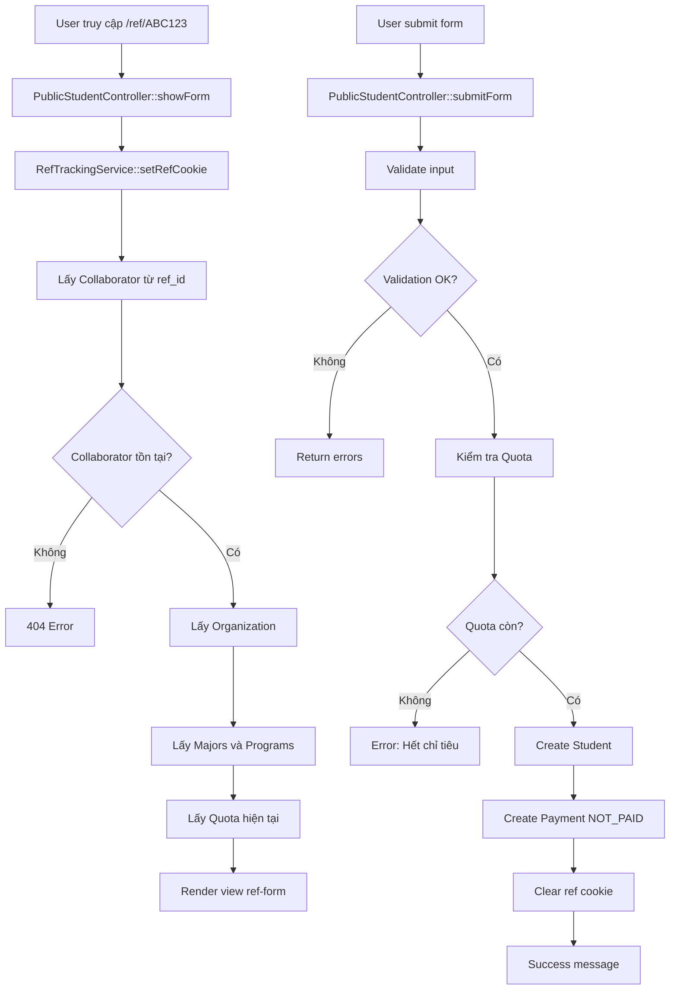
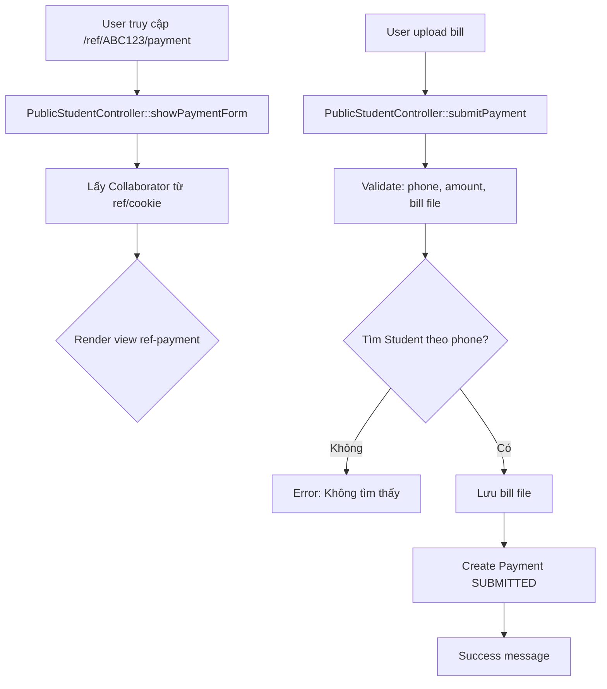
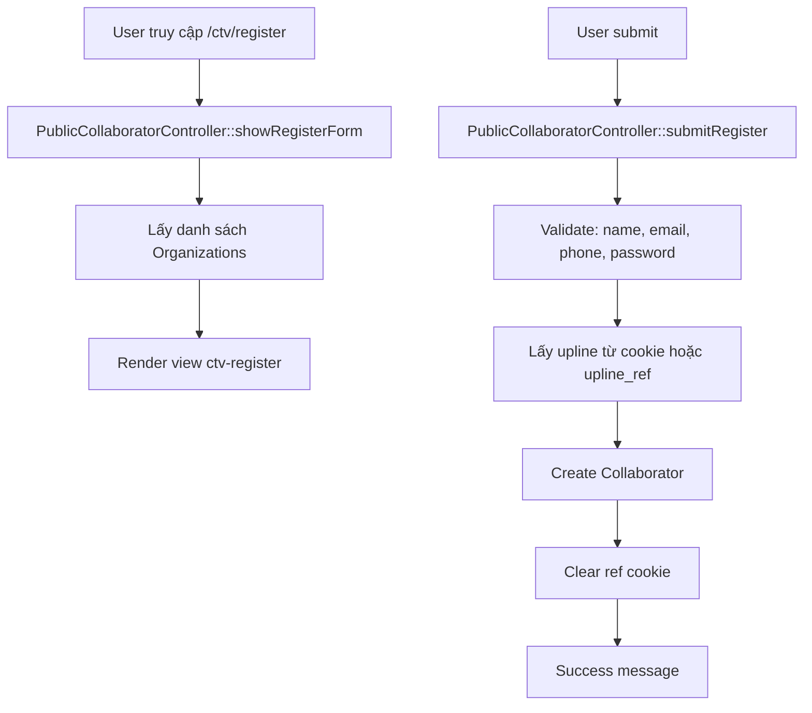
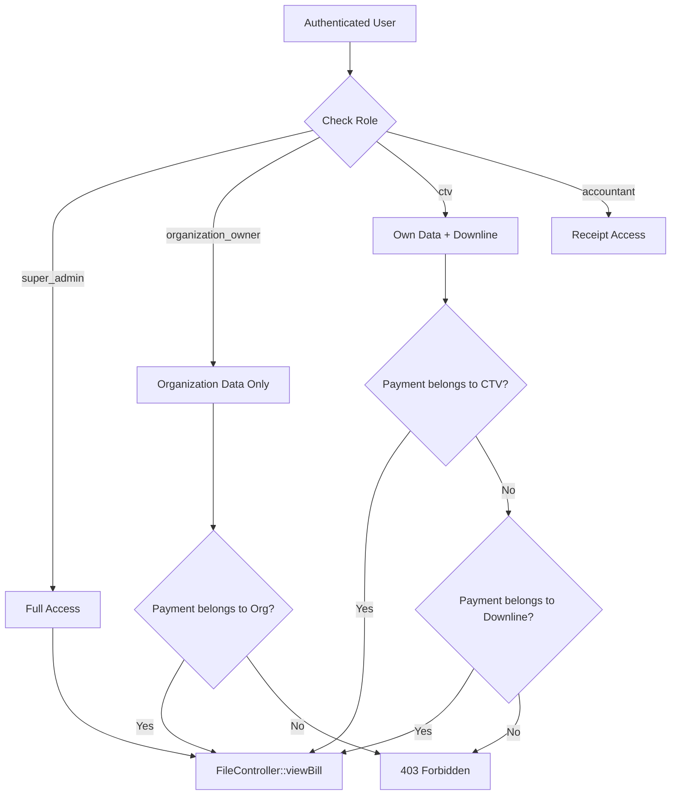
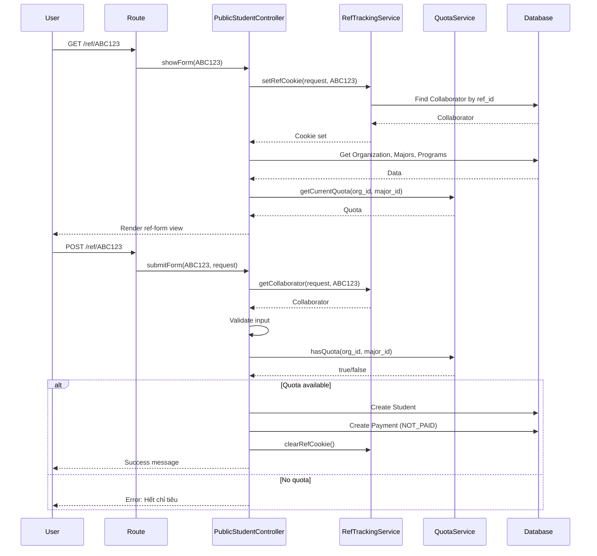
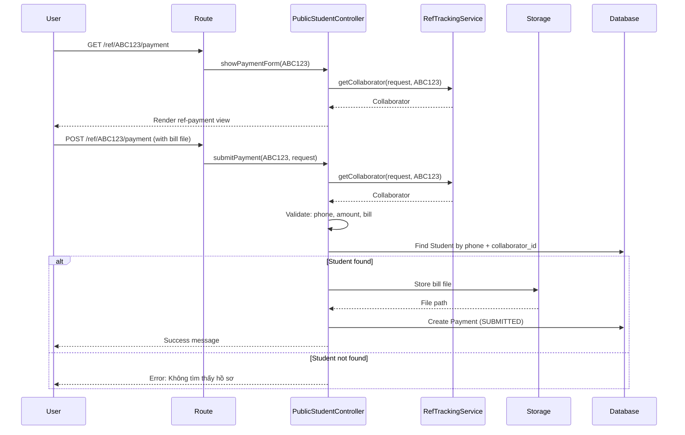
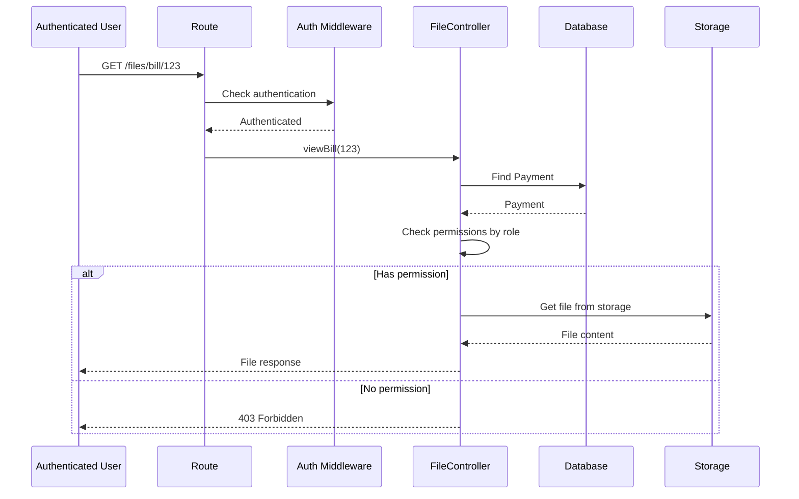

# Knowledge: Web Routes (routes/web.php)

## Tổng Quan

**Mục đích**: File `routes/web.php` định nghĩa tất cả các web routes công khai và được bảo vệ của hệ thống CRM quản lý cộng tác viên và học viên liên thông.

**Ngôn ngữ**: PHP (Laravel Framework)

**Hành vi cấp cao**:

-   Điều hướng người dùng từ root URL đến admin login
-   Cung cấp các form công khai cho học viên đăng ký và nộp thanh toán
-   Cung cấp form đăng ký cộng tác viên
-   Xử lý xem file (bill, receipt) với authentication
-   Xử lý notifications với authentication

**Entry Point**: Root route `/` redirect đến `/admin/login`

## Chi Tiết Implementation

### Cấu Trúc Routes

File routes được chia thành các nhóm chính:

1. **Root Route**: Redirect đến admin login
2. **Public Student Routes**: Form đăng ký học viên và thanh toán
3. **Public Collaborator Routes**: Form đăng ký cộng tác viên
4. **Authenticated Routes**: Xem file và notifications (yêu cầu đăng nhập)

### Luồng Xử Lý Chính

#### 1. Root Route (`/`)

```php
Route::get('/', function () {
    return redirect('/admin/login');
});
```

-   **Mục đích**: Redirect tất cả truy cập root đến trang admin login
-   **Không có middleware**: Public access

#### 2. Public Student Registration Routes

**Route Pattern**: `/ref/{ref_id}` và `/ref/{ref_id}/student`



**Controllers**: `PublicStudentController`

-   `showForm($ref_id)`: Hiển thị form đăng ký học viên
-   `submitForm($ref_id, Request)`: Xử lý submit form đăng ký

**Dependencies**:

-   `RefTrackingService`: Quản lý ref_id cookie
-   `QuotaService`: Kiểm tra quota ngành học
-   Models: `Collaborator`, `Organization`, `Student`, `Payment`, `Major`, `Program`

#### 3. Payment Upload Routes

**Route Pattern**: `/ref/{ref_id}/payment`



**Controllers**: `PublicStudentController`

-   `showPaymentForm($ref_id)`: Hiển thị form upload bill
-   `submitPayment($ref_id, Request)`: Xử lý upload bill và tạo Payment

**File Upload**:

-   Validation: `jpg,jpeg,png,pdf`, max 5MB
-   Storage: `storage/app/public/bills/`
-   Status: Payment được tạo với status `SUBMITTED`

#### 4. Collaborator Registration Routes

**Route Patterns**:

-   `/collaborator/register` (cũ)
-   `/collaborators/register` (mới)
-   `/ctv/register` (public)



**Controllers**:

-   `PublicCollaboratorController`: Public registration (không cần approve)
-   `CollaboratorRegistrationController`: Registration cần admin approve

**Khác biệt**:

-   `PublicCollaboratorController`: Tạo Collaborator với status `active` ngay
-   `CollaboratorRegistrationController`: Tạo Collaborator với status `pending`, cần admin approve

#### 5. Authenticated Routes

**Middleware**: `['auth']` - Yêu cầu đăng nhập

**Routes**:

-   `/files/bill/{paymentId}`: Xem bill thanh toán
-   `/files/receipt/{paymentId}`: Xem phiếu thu
-   `/files/commission-bill/{commissionItemId}`: Xem bill hoa hồng
-   `/admin/notifications/{id}/mark-read`: Đánh dấu notification đã đọc
-   `/admin/notifications/mark-all-read`: Đánh dấu tất cả đã đọc



**FileController Methods**:

-   `viewBill($paymentId)`: Xem bill với permission check
-   `viewReceipt($paymentId)`: Xem receipt (super_admin, accountant, organization_owner, ctv)
-   `viewCommissionBill($commissionItemId)`: Xem commission bill

**Permission Logic**:

-   **Super Admin**: Xem tất cả
-   **Organization Owner**: Chỉ xem data của tổ chức mình
-   **CTV**: Xem data của mình và downline trong nhánh
-   **Accountant**: Xem receipt

## Dependencies

### Controllers (Depth 1)

1. **PublicStudentController** (`app/Http/Controllers/PublicStudentController.php`)

    - Dependencies: `RefTrackingService`, `QuotaService`
    - Models: `Collaborator`, `Organization`, `Student`, `Payment`, `Major`, `Program`
    - Methods: `showForm()`, `submitForm()`, `showPaymentForm()`, `submitPayment()`

2. **PublicCollaboratorController** (`app/Http/Controllers/PublicCollaboratorController.php`)

    - Dependencies: `RefTrackingService`
    - Models: `Collaborator`, `Organization`
    - Methods: `showRegisterForm()`, `submitRegister()`, `showRefRegister()`, `submitRefRegister()`

3. **CollaboratorRegistrationController** (`app/Http/Controllers/CollaboratorRegistrationController.php`)

    - Models: `CollaboratorRegistration`, `Collaborator`, `Organization`
    - Methods: `showRegistrationForm()`, `store()`, `checkStatus()`

4. **FileController** (`app/Http/Controllers/FileController.php`)
    - Dependencies: `Storage`, `Auth`
    - Models: `Payment`, `Student`, `Organization`, `Collaborator`, `CommissionItem`
    - Methods: `viewBill()`, `viewReceipt()`, `viewCommissionBill()`, `serveFile()`, `getDownlineIds()`

### Services (Depth 2)

1. **RefTrackingService** (`app/Services/RefTrackingService.php`)

    - Purpose: Quản lý ref_id cookie để tracking CTV giới thiệu
    - Methods:
        - `setRefCookie(Request, string)`: Lưu ref_id vào cookie (30 ngày)
        - `getRefFromCookie(Request)`: Lấy ref_id từ cookie
        - `clearRefCookie()`: Xóa ref cookie
        - `getCollaborator(Request, ?string)`: Lấy Collaborator từ ref_id hoặc cookie

2. **QuotaService** (`app/Services/QuotaService.php`)
    - Purpose: Quản lý quota (chỉ tiêu) cho các ngành học
    - Used in: `PublicStudentController::submitForm()` để kiểm tra quota trước khi tạo Student

### Models (Depth 2)

1. **Collaborator**: CTV với ref_id, organization_id, upline_id
2. **Student**: Học viên với collaborator_id, organization_id, major_id
3. **Payment**: Thanh toán với student_id, primary_collaborator_id, sub_collaborator_id
4. **Organization**: Tổ chức với majors và programs
5. **Major**: Ngành học với quota và intake_months
6. **Program**: Chương trình đào tạo (REGULAR, PART_TIME)
7. **CommissionItem**: Chi tiết hoa hồng

### Middleware (Depth 1)

-   **`auth`**: Laravel authentication middleware
    -   Applied to: File viewing routes và notification routes
    -   Purpose: Đảm bảo user đã đăng nhập
    -   Returns: Redirect to login nếu chưa authenticated

### External Packages

-   **Laravel Framework**: Routing, Request handling, Response
-   **Laravel Storage**: File storage và retrieval
-   **Laravel Auth**: Authentication system

## Data Flow

### Student Registration Flow



### Payment Upload Flow



### File Viewing Flow (Authenticated)



## Error Handling

### Validation Errors

**Student Registration**:

-   Phone/Email duplicate: Return với error message
-   Invalid major/program: Return với error message
-   Quota exhausted: Return với error "Ngành này đã hết chỉ tiêu!"
-   Invalid organization: Return với error "Bạn không được chọn đơn vị này"

**Payment Upload**:

-   Student not found: Return với error "Không tìm thấy hồ sơ sinh viên"
-   Invalid file: Laravel validation errors
-   File too large: Laravel validation errors

### Permission Errors

**File Viewing**:

-   Not authenticated: Redirect to login (middleware)
-   No permission: `abort(403, 'Không có quyền truy cập file này')`
-   File not found: `abort(404, 'File không tồn tại')`

### Exception Handling

**CollaboratorRegistrationController**:

```php
try {
    // Create collaborator
} catch (\Exception $e) {
    Log::error('Lỗi khi đăng ký cộng tác viên: ' . $e->getMessage());
    return redirect()->back()
        ->with('error', 'Có lỗi xảy ra khi đăng ký. Vui lòng thử lại sau.')
        ->withInput();
}
```

## Performance Considerations

### Caching

-   **Ref Cookie**: Lưu ref_id trong cookie để tránh query database mỗi request
-   **Cookie Expiry**: 30 ngày (2592000 seconds)

### Database Queries

**Optimization Opportunities**:

-   `PublicStudentController::showForm()`: Nhiều queries riêng lẻ có thể optimize với eager loading
-   `FileController::getDownlineIds()`: Recursive query có thể cache hoặc optimize

**Current Optimizations**:

-   Sử dụng `pluck()` cho simple data retrieval
-   Sử dụng `firstOrFail()` để fail fast

### File Storage

-   **Storage Disk**: `public` disk cho bills
-   **File Size Limit**: 5MB (5120 KB)
-   **File Types**: jpg, jpeg, png, pdf

## Security Considerations

### Authentication & Authorization

1. **Public Routes**: Không có authentication, nhưng có validation
2. **Authenticated Routes**: Yêu cầu `auth` middleware
3. **Permission Checks**:
    - Role-based access control trong FileController
    - Organization-scoped access cho organization_owner
    - Downline-scoped access cho CTV

### Input Validation

**Student Registration**:

-   Phone: Required, unique, max 20 chars
-   Email: Optional, email format, unique
-   Major/Program: Must exist và belong to organization
-   Quota: Checked before creation

**Payment Upload**:

-   Phone: Required, must match existing student
-   Amount: Required, numeric, min 1000
-   Bill: Required, file, mimes: jpg,jpeg,png,pdf, max 5MB

**Collaborator Registration**:

-   Email: Required, unique
-   Phone: Required, unique
-   Password: Required, min 6 chars, confirmed

### File Security

-   **Storage**: Files stored in `storage/app/public/bills/`
-   **Access Control**: Permission check trước khi serve file
-   **MIME Type**: Detected và set trong response headers
-   **Content-Disposition**: `inline` để hiển thị trong browser

### Cookie Security

**Ref Cookie Settings**:

-   `secure`: false (HTTP allowed)
-   `httpOnly`: false (JavaScript accessible - có thể cần review)
-   `sameSite`: 'Lax'
-   **Risk**: Cookie có thể bị JavaScript access, cần review nếu có XSS concerns

## Patterns & Best Practices

### Service Layer Pattern

-   `RefTrackingService`: Tách logic tracking ref_id ra service riêng
-   `QuotaService`: Tách logic quota ra service riêng
-   Benefits: Reusability, testability, separation of concerns

### Route Naming

-   Consistent naming: `public.ref.form`, `public.ref.submit`
-   Descriptive names: `files.bill.view`, `notifications.mark-read`
-   Grouped by feature: `/ref/*`, `/files/*`, `/admin/*`

### Error Messages

-   Vietnamese error messages cho user-friendly experience
-   Specific error messages: "Ngành này đã hết chỉ tiêu!" thay vì generic error
-   Input preservation: `withInput()` để giữ lại form data khi có lỗi

## Potential Improvements

### Security

1. **Cookie Security**:

    - Consider setting `httpOnly: true` nếu không cần JavaScript access
    - Consider `secure: true` trong production với HTTPS

2. **Rate Limiting**:

    - Thêm rate limiting cho registration routes để prevent spam
    - Thêm rate limiting cho file viewing routes

3. **CSRF Protection**:
    - Đảm bảo tất cả POST routes có CSRF token (Laravel tự động với `@csrf`)

### Performance

1. **Query Optimization**:

    - Eager load relationships trong `showForm()` để giảm N+1 queries
    - Cache organization majors/programs nếu không thay đổi thường xuyên

2. **File Serving**:
    - Consider CDN cho file serving nếu có nhiều traffic
    - Consider streaming cho large files

### Code Quality

1. **Error Handling**:

    - Consistent error handling pattern across controllers
    - Consider custom exceptions cho business logic errors

2. **Validation**:

    - Move validation rules to Form Request classes
    - Reuse validation rules giữa các controllers

3. **Testing**:
    - Unit tests cho RefTrackingService
    - Feature tests cho registration flows
    - Integration tests cho file viewing với permissions

## Related Areas

### Related Entry Points

1. **Filament Admin Routes**: `/admin/*` - Admin panel routes (không trong file này)
2. **API Routes**: `routes/api.php` - API endpoints (nếu có)
3. **Models**: `app/Models/` - Data models được sử dụng
4. **Services**: `app/Services/` - Business logic services

### Next Steps for Deep Dive

1. **RefTrackingService**: Phân tích chi tiết cookie management và security
2. **QuotaService**: Phân tích quota calculation logic
3. **FileController**: Phân tích permission logic và downline calculation
4. **Payment Flow**: Phân tích complete payment workflow từ SUBMITTED → VERIFIED
5. **Commission Calculation**: Phân tích cách commission được tính khi payment verified

## Metadata

-   **Entry Point**: `routes/web.php`
-   **Analysis Date**: 2024-12-19
-   **Analysis Depth**: 3 levels (Routes → Controllers → Services/Models)
-   **Files Analyzed**:
    -   `routes/web.php`
    -   `app/Http/Controllers/PublicStudentController.php`
    -   `app/Http/Controllers/PublicCollaboratorController.php`
    -   `app/Http/Controllers/CollaboratorRegistrationController.php`
    -   `app/Http/Controllers/FileController.php`
    -   `app/Services/RefTrackingService.php`
-   **Total Routes**: 15 routes
-   **Public Routes**: 10 routes
-   **Authenticated Routes**: 5 routes
