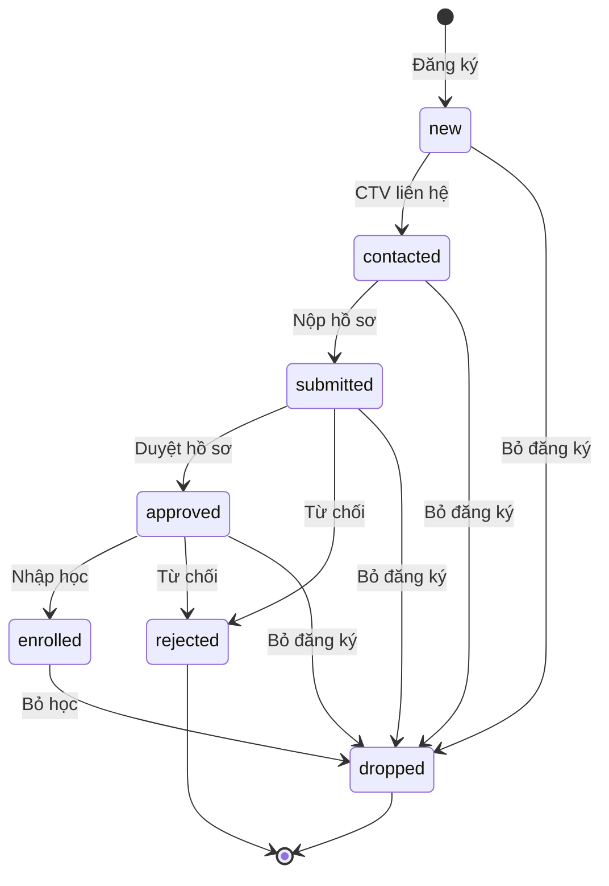
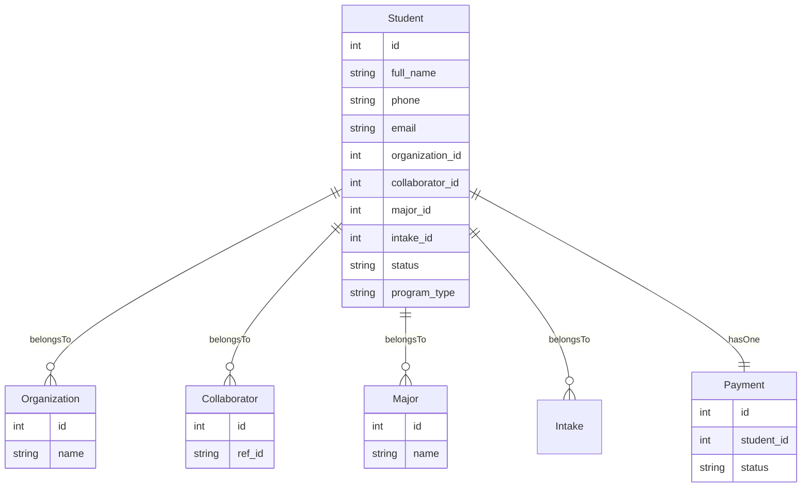
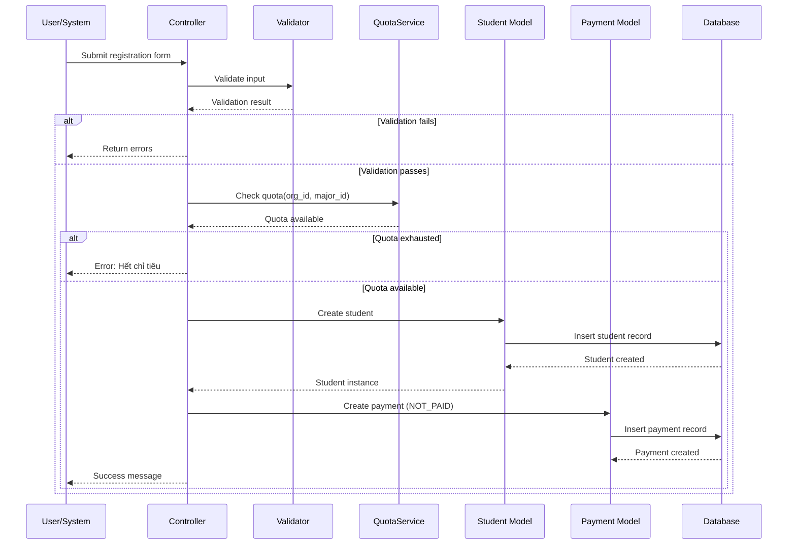
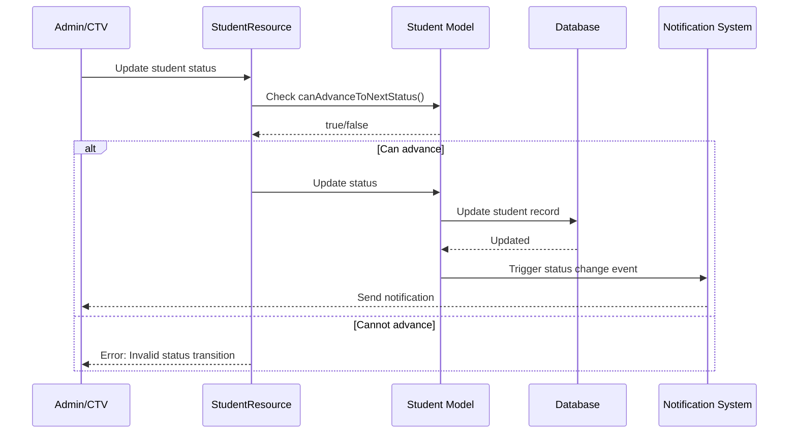
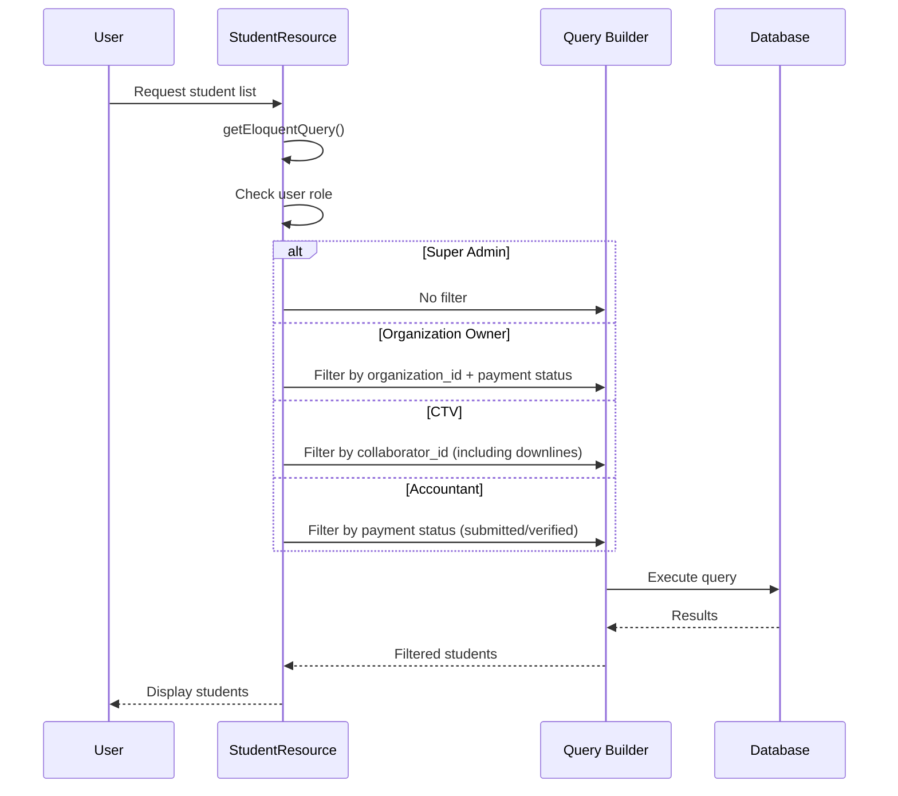

# Knowledge: Student Model

## Tổng Quan

**Mục đích**: Model `Student` đại diện cho học viên trong hệ thống CRM quản lý tuyển sinh liên thông đại học. Model này quản lý thông tin cá nhân, trạng thái tuyển sinh, và các mối quan hệ với tổ chức, cộng tác viên, ngành học.

**Ngôn ngữ**: PHP (Laravel Eloquent ORM)

**Hành vi cấp cao**:

-   Lưu trữ thông tin học viên và quản lý pipeline tuyển sinh (từ đăng ký đến nhập học)
-   Quản lý trạng thái với state machine pattern
-   Liên kết với Payment để theo dõi thanh toán
-   Hỗ trợ phân quyền truy cập dữ liệu theo role

**Core Entity**: Trung tâm của hệ thống tuyển sinh, kết nối Organization, Collaborator, Major, Payment

## Chi Tiết Implementation

### Cấu Trúc Dữ Liệu

**Table**: `students`

**Fillable Fields**:

```php
[
    'full_name',           // Họ tên học viên
    'phone',               // SĐT (unique)
    'email',               // Email (nullable, unique)
    'identity_card',       // CMND/CCCD (nullable, unique)
    'organization_id',     // FK đến organizations
    'collaborator_id',     // FK đến collaborators (nullable)
    'major_id',            // FK đến majors (nullable)
    'intake_id',           // FK đến intakes (nullable)
    'target_university',   // Trường đích (string)
    'major',               // Tên ngành (string, duplicate với major_id)
    'intake_month',        // Tháng tuyển sinh (1-12)
    'program_type',        // REGULAR hoặc PART_TIME
    'source',              // Nguồn tuyển sinh (enum)
    'status',              // Trạng thái pipeline (enum)
    'notes',               // Ghi chú
    'dob',                 // Ngày sinh
    'address',             // Địa chỉ
    'document_checklist',  // JSON array - checklist giấy tờ
]
```

**Casts**:

-   `document_checklist`: `array` - Tự động serialize/deserialize JSON

### Status Pipeline (State Machine)

Model Student sử dụng state machine pattern để quản lý pipeline tuyển sinh:



**Status Constants**:

-   `STATUS_NEW = 'new'`: Mới đăng ký
-   `STATUS_CONTACTED = 'contacted'`: Đã liên hệ
-   `STATUS_SUBMITTED = 'submitted'`: Đã nộp hồ sơ
-   `STATUS_APPROVED = 'approved'`: Đã duyệt
-   `STATUS_ENROLLED = 'enrolled'`: Đã nhập học
-   `STATUS_REJECTED = 'rejected'`: Từ chối
-   `STATUS_DROPPED = 'dropped'`: Bỏ học

**Status Transition Methods**:

-   `canAdvanceToNextStatus()`: Kiểm tra có thể chuyển trạng thái không
-   `getNextAvailableStatuses()`: Lấy danh sách trạng thái có thể chuyển đến
-   `isCompleted()`: Kiểm tra đã hoàn thành pipeline chưa (enrolled/rejected/dropped)

**Lưu ý**: Validation rules có thêm các status khác (`pending`, `interviewed`, `deposit_paid`, `offer_sent`, `offer_accepted`) nhưng không được sử dụng trong state machine logic.

### Relationships



**Relationship Methods**:

-   `organization()`: `belongsTo(Organization)` - Tổ chức học viên thuộc về
-   `collaborator()`: `belongsTo(Collaborator)` - CTV phụ trách (nullable)
-   `major()`: `belongsTo(Major)` - Ngành học (nullable)
-   `intake()`: `belongsTo(Intake)` - Đợt tuyển sinh (nullable)
-   `payment()`: `hasOne(Payment)` - Thanh toán của học viên

### Validation Rules

**Static Method**: `getValidationRules()`

**Rules**:

-   `full_name`: Required, string, max 255
-   `phone`: Required, string, max 20, unique (except current record)
-   `email`: Optional, email format, max 255, unique (except current record)
-   `identity_card`: Optional, string, max 20, unique (except current record)
-   `organization_id`: Required, exists in organizations
-   `collaborator_id`: Optional, exists in collaborators
-   `program_type`: Optional, enum ['REGULAR', 'PART_TIME']
-   `source`: Required, enum ['form', 'ref', 'facebook', 'zalo', 'tiktok', 'hotline', 'event', 'school', 'walkin', 'other']
-   `status`: Required, enum với nhiều giá trị (bao gồm cả các status không dùng trong state machine)
-   `intake_month`: Optional, integer, between 1-12
-   `dob`: Optional, date, before today

**Lưu ý**: Validation rules có một số inconsistency:

-   Status enum trong validation có nhiều giá trị hơn status constants trong model
-   Có thể cần sync lại để đảm bảo consistency

## Dependencies

### Direct Dependencies (Depth 1)

1. **Laravel Eloquent**:

    - `Illuminate\Database\Eloquent\Model`
    - `Illuminate\Database\Eloquent\Factories\HasFactory`
    - `Illuminate\Validation\Rule`

2. **Related Models**:
    - `App\Models\Organization`
    - `App\Models\Collaborator`
    - `App\Models\Major`
    - `App\Models\Intake`
    - `App\Models\Payment` (implicit qua relationship)

### Indirect Dependencies (Depth 2)

1. **Through Organization**:

    - `App\Models\User` (organization_owner)
    - `App\Models\Major` (many-to-many)
    - `App\Models\Program` (many-to-many)

2. **Through Collaborator**:

    - `App\Models\Wallet`
    - `App\Models\CommissionItem`

3. **Through Payment**:
    - `App\Models\Commission`
    - `App\Models\User` (verified_by, edited_by)

### Usage Points (Depth 3)

**Controllers**:

-   `PublicStudentController`: Tạo và quản lý học viên từ public forms
-   `FileController`: Kiểm tra quyền truy cập file

**Filament Resources**:

-   `StudentResource`: Admin interface cho quản lý học viên
-   `PaymentResource`: Hiển thị thông tin học viên trong payment
-   `CommissionResource`: Liên kết với học viên để tính hoa hồng

**Services**:

-   `QuotaService`: Kiểm tra quota khi tạo học viên
-   `RefTrackingService`: Liên kết học viên với CTV qua ref_id

**Widgets**:

-   `CtvStudentsWidget`: Hiển thị số học viên của CTV
-   `CtvPersonalStats`: Thống kê học viên cá nhân

## Data Flow

### Student Creation Flow



### Status Transition Flow



### Permission-Based Query Flow



## Security Considerations

### Data Access Control

**Permission Logic** (trong `StudentResource::getEloquentQuery()`):

1. **Super Admin**:

    - Xem tất cả học viên
    - Query: No filter

2. **Organization Owner**:

    - Chỉ xem học viên của tổ chức mình
    - Chỉ xem học viên đã nộp tiền (SUBMITTED hoặc VERIFIED)
    - Query: `where('organization_id', $org->id)->whereHas('payment', ...)`

3. **CTV**:

    - Xem học viên của mình và downline trong nhánh
    - Query: `whereIn('collaborator_id', [$self_id, ...downline_ids])`
    - Sử dụng recursive function `getDownlineIds()` để lấy tất cả downline

4. **Accountant**:
    - Chỉ xem học viên đã nộp tiền (để xác minh)
    - Query: `whereHas('payment', whereIn('status', ['submitted', 'verified']))`

### Input Validation

**Unique Constraints**:

-   `phone`: Unique trong bảng students
-   `email`: Unique (nullable)
-   `identity_card`: Unique (nullable)

**Foreign Key Constraints**:

-   `organization_id`: Must exist, cascade delete
-   `collaborator_id`: Must exist if provided, null on delete
-   `major_id`: Must exist if provided
-   `intake_id`: Must exist if provided

### Data Integrity

**Cascade Deletes**:

-   Khi Organization bị xóa → Tất cả Students của organization bị xóa
-   Khi Collaborator bị xóa → `collaborator_id` của Students được set null (nullOnDelete)

**Business Rules**:

-   Student phải thuộc về một Organization
-   Student có thể không có Collaborator (nullable)
-   Student có thể không có Payment ngay khi tạo (Payment được tạo riêng)

## Performance Considerations

### Database Indexes

**Unique Indexes**:

-   `phone` (unique)
-   `email` (unique, nullable)
-   `identity_card` (unique, nullable)

**Foreign Key Indexes**:

-   `organization_id` (indexed via foreign key)
-   `collaborator_id` (indexed via foreign key)
-   `major_id` (indexed via foreign key)
-   `intake_id` (indexed via foreign key)

**Potential Missing Indexes**:

-   `status`: Có thể cần index nếu query theo status thường xuyên
-   `source`: Có thể cần index cho reporting
-   `created_at`: Có thể cần index cho date range queries

### Query Optimization

**Eager Loading**:

-   Nên sử dụng `with(['organization', 'collaborator', 'major', 'payment'])` để tránh N+1 queries
-   `StudentResource` có thể optimize queries với eager loading

**N+1 Query Prevention**:

```php
// Bad: N+1 queries
$students = Student::all();
foreach ($students as $student) {
    echo $student->organization->name; // Query mỗi lần
}

// Good: Eager loading
$students = Student::with('organization')->get();
foreach ($students as $student) {
    echo $student->organization->name; // No additional queries
}
```

**Recursive Downline Query**:

-   `getDownlineIds()` trong `StudentResource` sử dụng recursive queries
-   Có thể optimize bằng cách cache downline IDs hoặc sử dụng closure table pattern
-   Hiện tại có thể chậm với nhiều levels của downline

### Caching Opportunities

1. **Status Options**: `getStatusOptions()` có thể cache (ít thay đổi)
2. **Downline IDs**: Cache downline IDs của CTV để tránh recursive queries
3. **Student Counts**: Cache counts trong navigation badge

## Patterns & Best Practices

### State Machine Pattern

**Implementation**:

-   Sử dụng constants cho status values
-   Methods để check và get next statuses
-   Centralized logic trong model

**Benefits**:

-   Dễ maintain và extend
-   Type-safe với constants
-   Clear business rules

**Potential Improvements**:

-   Có thể sử dụng state machine package (như `spatie/laravel-model-states`)
-   Hoặc implement proper state machine với events và transitions

### Validation Pattern

**Static Method Pattern**:

-   `getValidationRules()` là static method
-   Có thể reuse trong Form Requests và Controllers
-   Dynamic exclusion cho unique rules

**Issues**:

-   Validation rules có một số inconsistency với model constants
-   Status enum trong validation có nhiều giá trị hơn constants

### Relationship Pattern

**Standard Eloquent Relationships**:

-   Sử dụng standard Laravel relationships
-   Proper foreign key constraints
-   Cascade/nullOnDelete được config đúng

## Error Handling

### Validation Errors

**Handled By**:

-   Laravel validation trong controllers
-   Form Requests (nếu có)
-   Model validation rules

**Error Messages**:

-   Vietnamese error messages cho user-friendly experience
-   Specific messages cho từng validation rule

### Database Errors

**Foreign Key Violations**:

-   Handled by database constraints
-   Laravel throws `QueryException`

**Unique Constraint Violations**:

-   Handled by validation rules
-   Returns user-friendly error messages

### Business Logic Errors

**Status Transitions**:

-   `canAdvanceToNextStatus()` check trước khi update
-   Returns boolean, không throw exception
-   Controller phải check và handle error

**Quota Checking**:

-   Handled by `QuotaService` trước khi create
-   Returns error message nếu hết quota

## Potential Improvements

### Code Quality

1. **Status Consistency**:

    - Sync validation rules với status constants
    - Remove unused statuses hoặc implement đầy đủ trong state machine

2. **State Machine**:

    - Consider sử dụng state machine package
    - Add events cho status transitions
    - Add history tracking cho status changes

3. **Validation**:
    - Move validation rules to Form Request classes
    - Separate concerns: model validation vs form validation

### Performance

1. **Indexes**:

    - Add indexes cho `status`, `source`, `created_at` nếu cần
    - Review query patterns và add indexes accordingly

2. **Eager Loading**:

    - Ensure eager loading trong `StudentResource`
    - Add `with()` trong common queries

3. **Caching**:
    - Cache downline IDs
    - Cache status options
    - Cache student counts

### Features

1. **Status History**:

    - Track status change history
    - Who changed, when, why

2. **Soft Deletes**:

    - Consider soft deletes thay vì hard deletes
    - Preserve data for reporting

3. **Document Checklist**:

    - Implement UI cho document_checklist
    - Validation cho required documents

4. **Search/Filter**:
    - Full-text search cho name, phone, email
    - Advanced filters trong StudentResource

## Related Areas

### Related Models

1. **Payment**: Một học viên có một payment
2. **Commission**: Payment tạo commission, liên kết với student
3. **StudentPipeline**: Có thể track pipeline history
4. **StudentEvent**: Có thể track events trong pipeline
5. **StudentDocument**: Có thể quản lý documents

### Related Entry Points

1. **PublicStudentController**: Public registration flow
2. **StudentResource**: Admin interface
3. **PaymentObserver**: Có thể trigger events khi payment verified
4. **QuotaService**: Quota management

### Next Steps for Deep Dive

1. **Payment Flow**: Phân tích complete payment workflow
2. **Commission Calculation**: Phân tích cách commission được tính từ student
3. **QuotaService**: Phân tích quota logic chi tiết
4. **StudentResource**: Phân tích Filament resource implementation
5. **StudentPipeline/StudentEvent**: Phân tích tracking features

## Metadata

-   **Entry Point**: `app/Models/Student.php`
-   **Analysis Date**: 2024-12-19
-   **Analysis Depth**: 3 levels (Model → Relationships → Usage Points)
-   **Files Analyzed**:
    -   `app/Models/Student.php`
    -   `app/Filament/Resources/Students/StudentResource.php`
    -   `app/Http/Controllers/PublicStudentController.php`
    -   `app/Models/Payment.php`
    -   `app/Models/Organization.php`
    -   `app/Models/Collaborator.php`
    -   `database/migrations/2025_08_19_161509_create_students_table.php`
-   **Total Relationships**: 5 (organization, collaborator, major, intake, payment)
-   **Status Values**: 7 constants (có thêm các giá trị khác trong validation)
-   **Fillable Fields**: 19 fields
