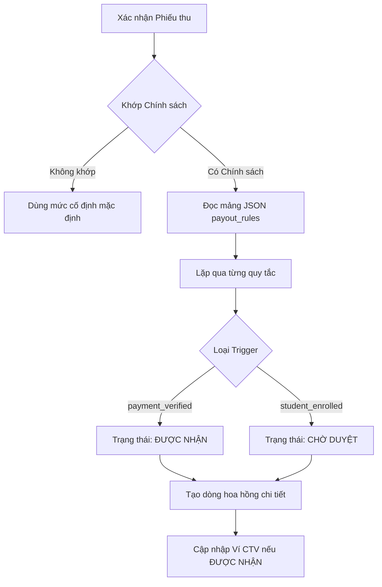

# Kế hoạch Triển khai: Hoàn thiện Hệ thống Hoa hồng (V2)

Bản kế hoạch này chi tiết các bước để hoàn thiện và tối ưu hóa hệ thống hoa hồng linh hoạt, đảm bảo logic xử lý ở backend khớp hoàn toàn với giao diện (UI) mới và hỗ trợ tốt cơ chế chia tiền đa tầng qua mảng JSON.

## 1. Mục tiêu cốt lõi
- **Đồng bộ hóa**: Cập nhật logic khớp chính sách (Matching) theo giao diện đã đơn giản hóa (loại bỏ giới hạn thời gian).
- **Kiến trúc**: Đảm bảo `CommissionService` xử lý mảng JSON `payout_rules` như là phương thức phân bổ tiền chính.
- **Minh bạch**: Cải thiện khả năng hiển thị chi tiết hoa hồng cho cả Quản trị viên và Cộng tác viên.
- **Tự động hóa**: Kích hoạt việc tạo hoa hồng chính xác khi xác nhận thanh toán và khi sinh viên nhập học.

## 2. Sơ đồ luồng nghiệp vụ

## 3. Các giai đoạn thực hiện

### Giai đoạn 1: Đồng bộ Logic Backend
- [ ] **Đơn giản hóa Matching**: Cập nhật hàm `getMatchingPolicy` trong `CommissionService` để bỏ qua các trường `effective_from` và `effective_to` vì chúng đã bị xóa khỏi giao diện.
- [ ] **Xử lý Ưu tiên**: Đảm bảo trường `priority` (độ ưu tiên cao nhất) là yếu tố quyết định khi có nhiều chính sách cùng khớp.
- [ ] **Chuẩn hóa dữ liệu**: Ép kiểu `type` thành 'FIXED' cho tất cả chính sách dùng giao diện chia tiền mới để tránh lỗi tính toán kiểu cũ.

### Giai đoạn 2: Tự động hóa Vòng đời Hoa hồng
- [ ] **Đăng ký Observer**: Tạo `PaymentObserver` để tự động gọi `CommissionService` tạo hoa hồng ngay khi Phiếu thu được chuyển sang trạng thái `VERIFIED` (Đã xác nhận).
- [ ] **Kích hoạt khi Nhập học**: Đảm bảo `StudentObserver` gọi hàm `unlockCommissionsOnEnrollment` khi trạng thái sinh viên đổi thành `ENROLLED` (Đã nhập học).
- [ ] **Kiểm tra trùng lặp**: Tinh chỉnh cơ chế kiểm tra "Đã tồn tại" để hỗ trợ các quy tắc chia tiền đa tầng cho cùng một người nhận trong cùng một đợt mà không bị bỏ sót.

### Giai đoạn 3: Báo cáo & Tra cứu
- [ ] **Bảng quản lý Hoa hồng**: Xây dựng hoặc tinh chỉnh bảng hiển thị các dòng hoa hồng chi tiết (`commission_items`) để Admin biết chính xác: Tiền này trả cho ai, vì lý do gì và khi nào được trả.
- [ ] **Lịch sử giao dịch**: Lưu thêm thông tin (meta-data) vào từng dòng hoa hồng để giải thích tại sao chính sách đó được chọn.

## 4. Xử lý các trường hợp đặc biệt
- **Thay đổi chính sách**: Hoa hồng đã tạo sẽ giữ nguyên theo chính sách tại thời điểm phát sinh thanh toán (Idempotent).
- **Hủy thanh toán/Hoàn tiền**: Cần định nghĩa quy trình "thu hồi" hoặc hủy các dòng hoa hồng nếu sinh viên rút hồ sơ.

## 5. Kiểm tra & Xác nhận
- [ ] **Chạy Seeder**: Chạy `CommissionExampleSeeder` và kiểm tra các dòng tiền có tạo đúng số lượng và số tiền như kịch bản không.
- [ ] **Test thực tế**: Giả lập quy trình từ lúc đóng tiền -> Nhập học và kiểm tra trạng thái tiền từ "Chờ" sang "Được nhận".
