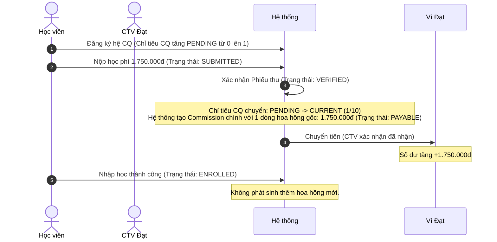
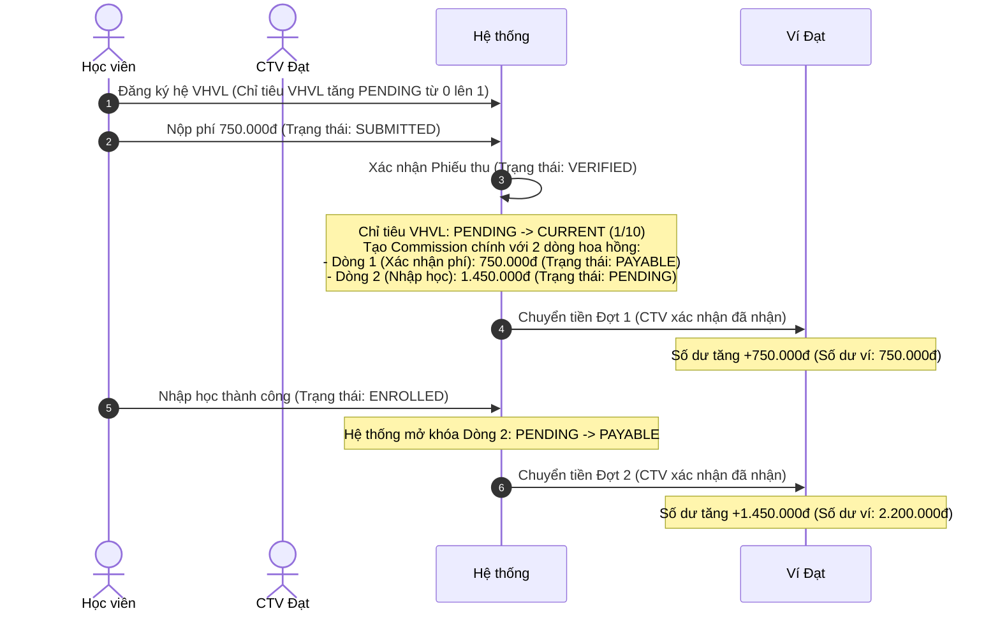

# Báo cáo luồng Đăng ký & Nhập học thành công (Happy Path)

Tài liệu này ghi lại chi tiết các trường hợp đăng ký thành công cho từng hệ đào tạo (Chính quy - CQ, Vừa học vừa làm - VHVL, và Đào tạo từ xa - Từ xa) đến tận bước nhập học thành công.

---

## 1. Các thực thể/đối tượng liên quan chính

1.  **Đợt tuyển sinh (`Intake`)**: Đợt Tháng 6/2026.
2.  **Cộng tác viên (`Collaborator`)**: Lê Trọng Đạt (Mã giới thiệu: `LETRONGDAT`).
3.  **Chính sách hoa hồng (`CommissionPolicy`)**: Chính sách hoa hồng dành riêng cho Lê Trọng Đạt:
    *   **Hệ Chính quy (`regular`)**: Nhận 1.75tr ngay khi xác nhận phí.
    *   **Hệ VHVL (`part_time`)**: Nhận 750k khi xác nhận phí + 1.45tr khi nhập học thành công.
    *   **Hệ Từ xa (`distance`)**: Nhận 750k khi xác nhận phí + 1.45tr khi nhập học thành công.
4.  **Chỉ tiêu tuyển sinh (`Quota`)**: Gắn với đợt tuyển sinh, ngành học và hệ đào tạo tương ứng.
5.  **Sinh viên (`Student`)**: Thông tin sinh viên mới đăng ký.
6.  **Phiếu thu (`Payment`)**: Ghi nhận thông tin thanh toán lệ phí/học phí.
7.  **Hoa hồng tổng (`Commission`)**: Ghi nhận hoa hồng liên quan tới phiếu thu.
8.  **Dòng hoa hồng (`CommissionItem`)**: Các khoản thanh toán hoa hồng chi tiết gửi tới ví CTV.

---

## 2. Chi tiết các trường hợp và vòng đời trạng thái

### Trường hợp 1: Hệ Chính quy (REGULAR)
*   **Mức phí học sinh nộp:** 1.750.000đ.
*   **Chi tiết luồng và biến động trạng thái:**

*   **Đối tượng & Giá trị cuối:**
    *   `Student`: Trạng thái = `enrolled`, Hệ đào tạo = `regular`.
    *   `Quota`: `current_quota` = 1, `target_quota` = 10.
    *   `CommissionItem`: 1 dòng trị giá **1,750,000đ**, trạng thái = `received_confirmed`.
    *   `Wallet` (Lê Trọng Đạt): Số dư = **1,750,000đ**.

---

### Trường hợp 2: Hệ Vừa học vừa làm (PART_TIME)
*   **Mức phí học sinh nộp:** 750.000đ.
*   **Chi tiết luồng và biến động trạng thái:**

*   **Đối tượng & Giá trị cuối:**
    *   `Student`: Trạng thái = `enrolled`, Hệ đào tạo = `part_time`.
    *   `Quota`: `current_quota` = 1, `target_quota` = 10.
    *   `CommissionItem 1`: Trị giá **750,000đ**, trạng thái = `received_confirmed`.
    *   `CommissionItem 2`: Trị giá **1,450,000đ**, trạng thái = `received_confirmed`.
    *   `Wallet` (Lê Trọng Đạt): Số dư = **2,200,000đ**.

---

### Trường hợp 3: Hệ Đào tạo từ xa (DISTANCE)
*   **Mức phí học sinh nộp:** 750.000đ.
*   **Chi tiết luồng và biến động trạng thái:**
    *   *Luồng hoạt động và các bước chuyển đổi trạng thái hoàn toàn giống hệt hệ VHVL (PART_TIME).*
*   **Đối tượng & Giá trị cuối:**
    *   `Student`: Trạng thái = `enrolled`, Hệ đào tạo = `distance`.
    *   `Quota`: `current_quota` = 1, `target_quota` = 10.
    *   `CommissionItem 1`: Trị giá **750,000đ**, trạng thái = `received_confirmed`.
    *   `CommissionItem 2`: Trị giá **1,450,000đ**, trạng thái = `received_confirmed`.
    *   `Wallet` (Lê Trọng Đạt): Số dư = **2,200,000đ**.
