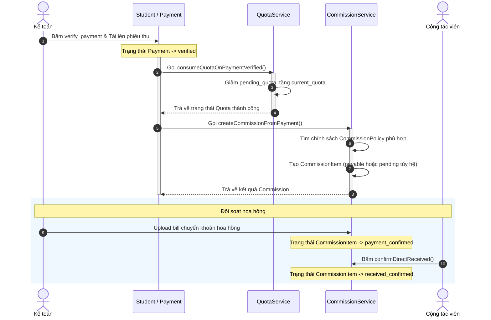

# 02-business-process.md - Quy trình nghiệp vụ & Sử dụng hệ thống

## 1. Quy trình Tuyển sinh & Giới thiệu (Enrollment & Referral Flow)
Quy trình bắt đầu khi một Cộng tác viên (CTV) chia sẻ liên kết giới thiệu (Referral Link) chứa mã `ref_id` duy nhất của mình.
1. **Truy cập Trang Đăng ký:** Hệ thống đọc `ref_id` từ URL hoặc Cookie để xác định CTV giới thiệu.
2. **Gửi Form Đăng ký:** Sinh viên hoặc CTV nhập thông tin cá nhân và thông tin học tập cấp THPT/CĐ, chọn ngành học và đợt tuyển sinh mong muốn.
3. **Kiểm tra Chỉ tiêu (Quota Checking):** Hệ thống kiểm tra xem đợt tuyển sinh và ngành học đó còn chỉ tiêu (Quota Available) hay không. Nếu còn, hồ sơ được tạo ở trạng thái Mới (`new`), đồng thời tăng tạm thời chỉ tiêu chờ duyệt (`pending_quota`).
4. **Nộp Lệ phí Tuyển sinh:** CTV nộp hóa đơn (bill) chuyển khoản phí tuyển sinh lên hệ thống (thông qua Web form hoặc qua ứng dụng Telegram bằng cách gửi ảnh Reply tin nhắn thông báo hồ sơ). Trạng thái hồ sơ chuyển thành Chờ xác minh (`submitted`).

### Evidence:
* Đọc và ghi cookie giới thiệu: [RefTrackingService.php](file:///Users/ken/Folders/Projects/Herd/crm-lien-thong/app/Services/RefTrackingService.php)
* Hiển thị form đăng ký và lấy thông tin: [PublicStudentController.php:L30-89](file:///Users/ken/Folders/Projects/Herd/crm-lien-thong/app/Http/Controllers/PublicStudentController.php#L30-L89)
* Xử lý gửi form đăng ký: [PublicStudentController.php:L92-214](file:///Users/ken/Folders/Projects/Herd/crm-lien-thong/app/Http/Controllers/PublicStudentController.php#L92-L214)
* Tăng chỉ tiêu chờ duyệt (pending): [QuotaService.php:L120-127](file:///Users/ken/Folders/Projects/Herd/crm-lien-thong/app/Services/QuotaService.php#L120-L127)
* Upload bill và chuyển trạng thái hồ sơ: [PublicStudentController.php:L231-296](file:///Users/ken/Folders/Projects/Herd/crm-lien-thong/app/Http/Controllers/PublicStudentController.php#L231-L296)
* Nhận và xử lý bill qua Telegram: [TelegramBotService.php:L52-144](file:///Users/ken/Folders/Projects/Herd/crm-lien-thong/app/Services/TelegramBotService.php#L52-L144)

---

## 2. Quy trình Xác minh & Chi trả Hoa hồng (Verification & Commission Payout Flow)
Quy trình đối soát tài chính và hoa hồng:
1. **Xác minh nộp tiền:** Kế toán hoặc Cán bộ hồ sơ xem minh chứng chuyển khoản (bill) và đối chiếu với ngân hàng. Nếu hợp lệ, Kế toán bấm **Xác minh thanh toán**, tải lên File Phiếu thu chính thức.
2. **Khấu trừ Chỉ tiêu chính thức:** Khi thanh toán được xác minh, hệ thống giảm chỉ tiêu chờ duyệt (`pending_quota`) và tăng chỉ tiêu chính thức (`current_quota`) của đợt tuyển sinh đó, đồng thời cộng dồn chỉ tiêu thực tế năm (`AnnualQuota`).
3. **Phát sinh Hoa hồng:** Hệ thống tự động tìm kiếm Chính sách hoa hồng khớp nhất với học viên (theo thứ tự ưu tiên: CTV được chỉ định -> Ngành học -> Hệ đào tạo). Tạo bản ghi `Commission` và các dòng hoa hồng chi tiết (`CommissionItem`).
   * **Hệ đào tạo Chính quy (Regular):** Hoa hồng được đánh dấu là Có thể thanh toán (`payable`) ngay mùng 5.
   * **Hệ đào tạo Vừa học vừa làm (Part-time) / Từ xa (Distance):** Hoa hồng được đánh dấu là Chờ nhập học (`pending`) và chỉ chuyển sang `payable` khi Cán bộ hồ sơ đổi trạng thái sinh viên thành Đã nhập học (`enrolled`).
4. **Đối soát & Chi trả:** Kế toán xuất File Excel chốt sổ đối soát, thực hiện chuyển tiền thực tế và đính kèm hóa đơn chi tiền (`payment_bill_path`). Hoa hồng chuyển sang trạng thái Đã chốt & Đã chi (`payment_confirmed`).
5. **Xác nhận nhận tiền:** CTV đăng nhập hệ thống và bấm xác nhận đã nhận được tiền, hoa hồng chuyển sang trạng thái hoàn thành (`received_confirmed`).

### Evidence:
* Logic đối soát & phát sinh hoa hồng: [CommissionService.php:L18-145](file:///Users/ken/Folders/Projects/Herd/crm-lien-thong/app/Services/CommissionService.php#L18-L145)
* Logic tìm kiếm chính sách phù hợp: [CommissionService.php:L150-179](file:///Users/ken/Folders/Projects/Herd/crm-lien-thong/app/Services/CommissionService.php#L150-L179)
* Chuyển trạng thái khi sinh viên nhập học: [CommissionService.php:L244-254](file:///Users/ken/Folders/Projects/Herd/crm-lien-thong/app/Services/CommissionService.php#L244-L254)
* Tiêu thụ chỉ tiêu khi xác minh: [QuotaService.php:L19-64](file:///Users/ken/Folders/Projects/Herd/crm-lien-thong/app/Services/QuotaService.php#L19-L64)
* Xác nhận nhận tiền từ CTV: [CommissionService.php:L228-239](file:///Users/ken/Folders/Projects/Herd/crm-lien-thong/app/Services/CommissionService.php#L228-L239)

---

## 3. Bản đồ Sử dụng hệ thống (Use Case & Sequence Diagrams)

### 3.1 Sơ đồ Use Case tổng quát (Mermaid)

```mermaid
usecaseDiagram
    actor "Sinh viên" as Student
    actor "Cộng tác viên (CTV)" as CTV
    actor "Cán bộ hồ sơ" as Officer
    actor "Kế toán" as Accountant
    
    Student --> (Đăng ký học viên mới)
    Student --> (Cập nhật hồ sơ & upload minh chứng)
    Student --> (Theo dõi trạng thái duyệt hồ sơ)
    
    CTV --> (Tạo Lead học viên)
    CTV --> (Nộp Bill chuyển khoản qua Web/Telegram)
    CTV --> (Xem báo cáo hoa hồng & ví tiền)
    CTV --> (Xác nhận đã nhận hoa hồng)
    
    Officer --> (Kiểm tra điều kiện ngành tốt nghiệp)
    Officer --> (Duyệt hồ sơ & đổi trạng thái sang Đã duyệt/Đã nhập học)
    Officer --> (Cấu hình đợt tuyển & chỉ tiêu Quota)
    
    Accountant --> (Xác minh nộp tiền & cập nhật phiếu thu)
    Accountant --> (Chốt sổ đối soát & chi trả hoa hồng)
```

### 3.2 Sơ đồ trình tự: Xác minh thanh toán & Kích hoạt hoa hồng (Sequence Diagram)


