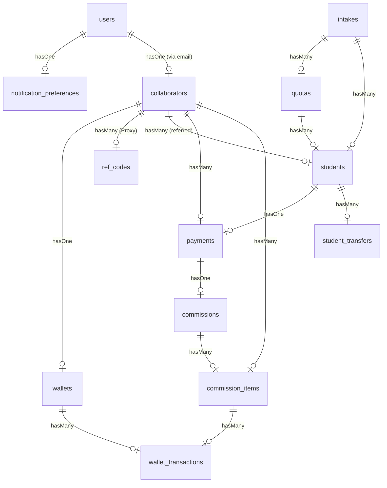

# 05-database-analysis.md - Thiết kế Cơ sở dữ liệu & Thực thể (ERD)

## 1. Sơ đồ quan hệ thực thể (ERD - Mermaid)

---

## 2. Phân tích chi tiết các bảng cốt lõi

### 2.1 Bảng `students` (Thông tin học viên tuyển sinh)
* **Khóa chính:** `id` (int), `uuid` (char 36 - Unique).
* **Trường dữ liệu quan trọng:** `profile_code` (Mã hồ sơ tự sinh), `status` (Trạng thái tuyển sinh), `application_status` (Checklist thực tế), `quota_id` / `intake_id` / `collaborator_id` (Khóa ngoại).
* **Chỉ mục (Indexes):** Hỗ trợ tìm kiếm nhanh theo CCCD, Email, Phone, và SoftDeletes index.
* **Evidence:** [Student.php](file:///Users/ken/Folders/Projects/Herd/crm-lien-thong/app/Models/Student.php), Migration `2025_08_19_161509_create_students_table.php`, Migration `2026_04_18_153915_fix_students_unique_indexes_for_soft_deletes.php`

### 2.2 Bảng `payments` (Xác minh nộp tiền học viên)
* **Khóa chính:** `id` (int), `uuid` (Unique).
* **Trường dữ liệu quan trọng:** `amount` (decimal), `status` (not_paid, submitted, verified, reverted), `bill_path` (đường dẫn bill chuyển khoản của sinh viên), `receipt_path` (đường dẫn phiếu thu chính thức).
* **Evidence:** [Payment.php](file:///Users/ken/Folders/Projects/Herd/crm-lien-thong/app/Models/Payment.php), Migration `2025_08_21_005447_create_payments_table.php`

### 2.3 Bảng `commission_items` (Chi tiết hoa hồng CTV)
* **Trường dữ liệu quan trọng:** `commission_id`, `recipient_collaborator_id`, `amount`, `status` (pending, payable, paid, cancelled, payment_confirmed, received_confirmed), `trigger` (payment_verified, student_enrolled).
* **Evidence:** [CommissionItem.php](file:///Users/ken/Folders/Projects/Herd/crm-lien-thong/app/Models/CommissionItem.php), Migration `2025_08_21_005518_create_commission_items_table.php`

---

## 3. Khóa ngoại và Ràng buộc (Foreign Keys & Constraints)
* **`Student` -> `Quota` & `Intake`**: Ràng buộc mềm. Khi xóa đợt tuyển hoặc chỉ tiêu, hệ thống dùng SoftDeletes để bảo toàn liên kết lịch sử.
* **`CommissionItem` -> `Collaborator`**: Liên kết khóa ngoại `recipient_collaborator_id` bắt buộc phải tồn tại trong bảng `collaborators` nhằm tránh việc phát sinh dòng hoa hồng vô chủ.
* **`WalletTransaction` -> `Wallet` & `CommissionItem`**: Tạo vết tài chính rõ ràng. Khi phát sinh giao dịch ví (`WalletTransaction`), trường `commission_id` hoặc `commission_item_id` (nếu có) sẽ ánh xạ ngược lại dòng tiền nguồn.

### Evidence:
* Migration khóa ngoại ví: `2025_08_23_000010_add_foreign_keys_to_wallets_and_transactions.php`
* Cấu trúc bảng ví và quan hệ: [Wallet.php](file:///Users/ken/Folders/Projects/Herd/crm-lien-thong/app/Models/Wallet.php)
