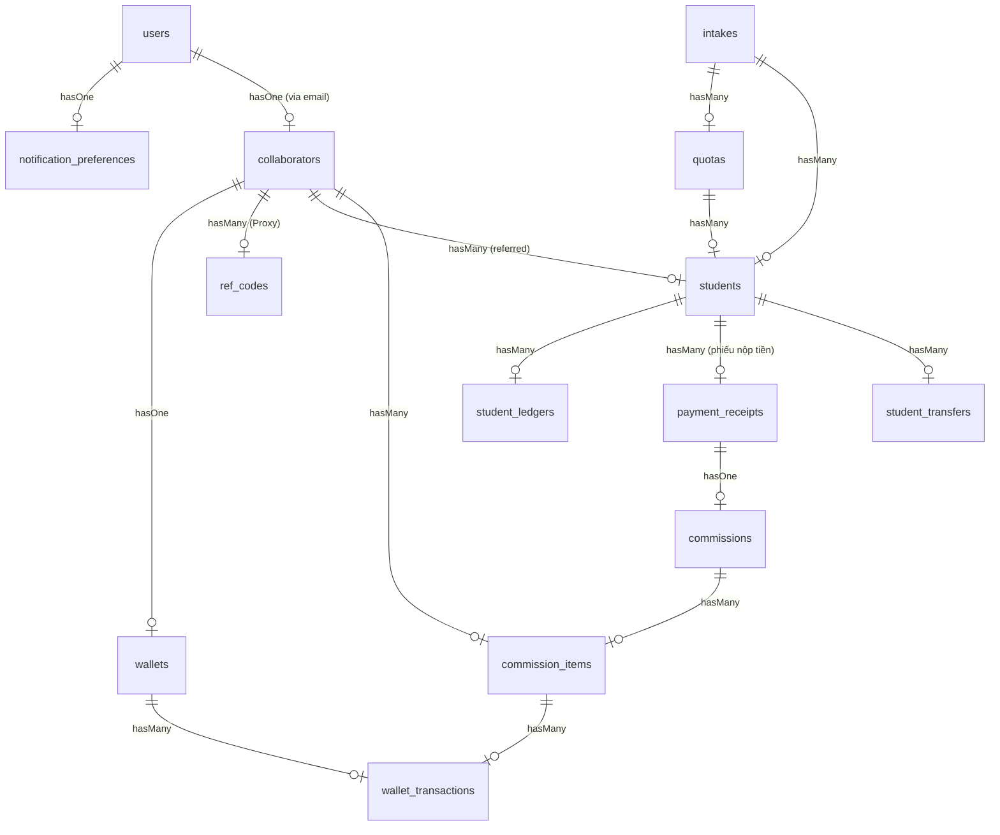

# 05-database-analysis.md - Thiết kế Cơ sở dữ liệu & Thực thể (ERD)

## 1. Sơ đồ quan hệ thực thể (ERD - Mermaid)

---

## 2. Phân tích chi tiết các bảng cốt lõi

### 2.1 Bảng `students` (Thông tin học viên tuyển sinh)
*   **Khóa chính:** `id` (int), `uuid` (char 36 - Unique).
*   **Trường dữ liệu quan trọng:** `profile_code` (Mã hồ sơ tự sinh), `status` (Trạng thái tuyển sinh), `application_status` (Checklist thực tế), `quota_id` / `intake_id` / `collaborator_id` (Khóa ngoại).
*   **Chỉ mục (Indexes):** Hỗ trợ tìm kiếm nhanh theo CCCD, Email, Phone, và SoftDeletes index.

### 2.2 Bảng `student_ledgers` (Sổ cái Công nợ Sinh viên)
*   **Khóa chính:** `id` (bigint).
*   **Trường dữ liệu:** 
    *   `student_id` (Khóa ngoại trỏ đến `students.id`).
    *   `type` (enum: `debit`, `credit`, `adjustment`, `refund`).
    *   `amount` (decimal: 15,2).
    *   `balance_after` (decimal: 15,2) - Số dư lũy kế sau giao dịch này.
    *   `description` (string) - Lý do giao dịch (ví dụ: "Phát sinh học phí CQ", "Hủy học phí do chuyển hệ").
    *   `created_by` (Khóa ngoại trỏ đến `users.id`).
*   **Mô tả:** Đảm bảo toàn bộ nghiệp vụ tài chính của sinh viên không bao giờ bị sửa đè. Mọi thay đổi đều được ghi sổ theo thứ tự thời gian.

### 2.3 Bảng `payment_receipts` (Trước đây là `payments` - Chứng từ nộp tiền)
*   **Khóa chính:** `id` (int), `uuid` (Unique).
*   **Trường dữ liệu quan trọng:** `student_id`, `amount` (decimal), `status` (not_paid, submitted, verified, reverted), `bill_path` (bill chuyển khoản), `receipt_path` (phiếu thu chính thức).
*   **Nguyên tắc bất biến:** Một khi đã ở trạng thái `verified`, trường `amount` cấm chỉnh sửa.

### 2.4 Bảng `commission_items` (Chi tiết hoa hồng CTV)
*   **Trường dữ liệu quan trọng:** `commission_id`, `recipient_collaborator_id`, `amount`, `status` (pending, payable, paid, cancelled, payment_confirmed, received_confirmed), `trigger` (payment_verified, student_enrolled).

---

## 3. Khóa ngoại và Ràng buộc (Foreign Keys & Constraints)
*   **`StudentLedger` -> `Student`**: Ràng buộc cứng. Không thể xóa sinh viên nếu còn tồn tại giao dịch trong Sổ cái công nợ chưa đối soát xong.
*   **`Student` -> `Quota` & `Intake`**: Ràng buộc mềm sử dụng SoftDeletes.
*   **`CommissionItem` -> `Collaborator`**: Liên kết khóa ngoại `recipient_collaborator_id` bắt buộc phải tồn tại trong bảng `collaborators` nhằm tránh việc phát sinh dòng hoa hồng vô chủ.
*   **`WalletTransaction` -> `Wallet` & `CommissionItem`**: Tạo vết tài chính rõ ràng. Khi phát sinh giao dịch ví (`WalletTransaction`), trường `commission_item_id` sẽ ánh xạ ngược lại dòng tiền nguồn.
