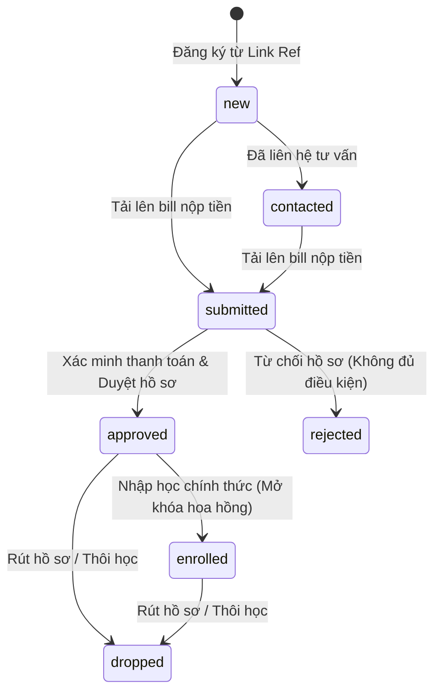
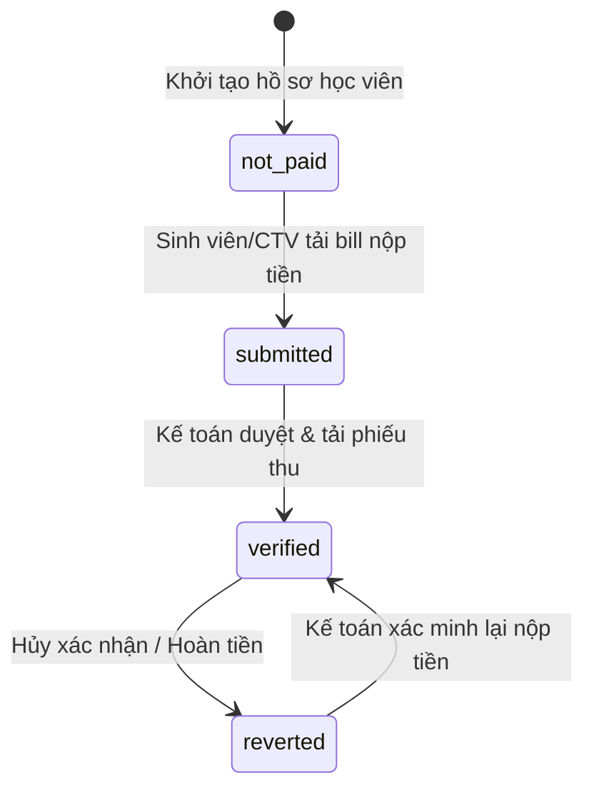
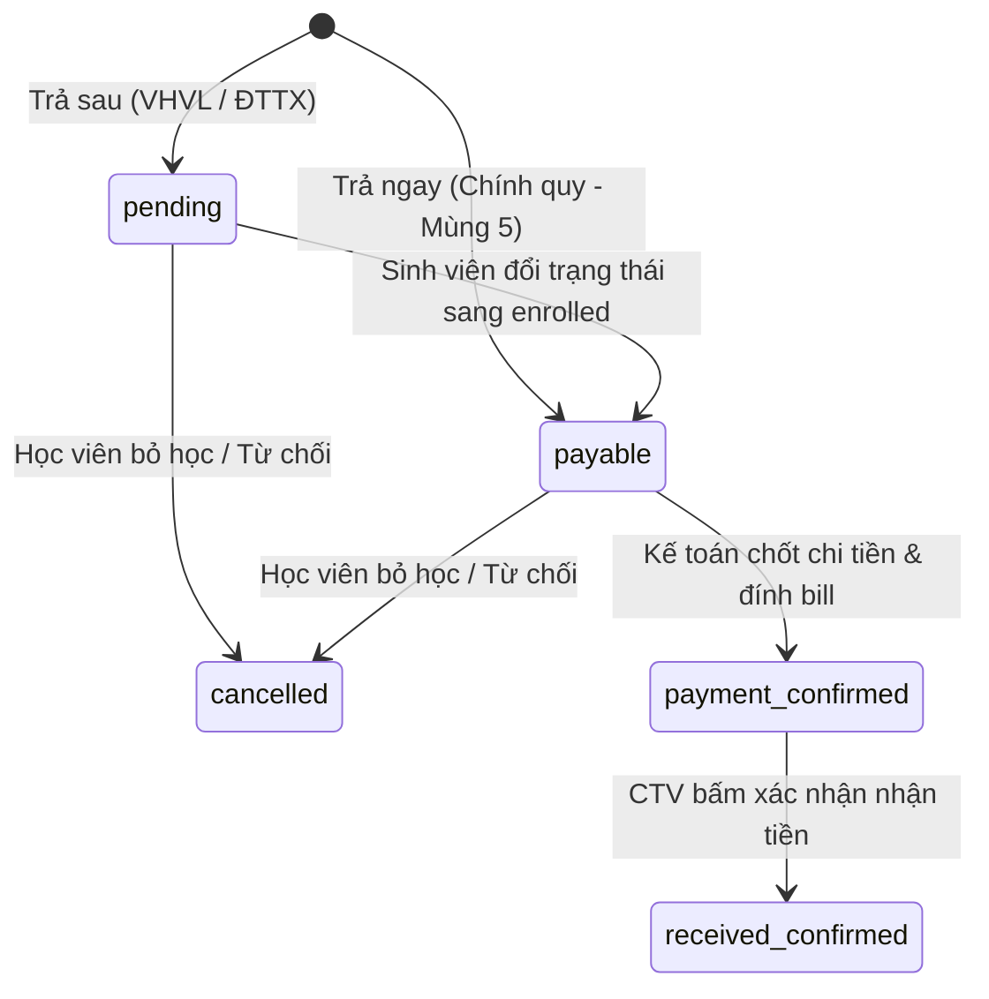

# 08-state-machine.md - Sơ đồ máy trạng thái & Chuyển đổi dữ liệu

## 1. Trạng thái Sinh viên (Student Status)

### 1.1 Danh sách trạng thái:
* **`new` (Mới):** Lead sinh viên mới tạo từ link giới thiệu.
* **`contacted` (Đã liên hệ):** Cán bộ tuyển sinh đã gọi điện tư vấn.
* **`submitted` (Chờ xác minh):** Học viên/CTV đã tải lên hóa đơn chuyển khoản (bill) học phí.
* **`approved` (Đã duyệt):** Cán bộ hồ sơ đã kiểm duyệt điều kiện văn bằng và đánh giá hợp lệ.
* **`enrolled` (Đã nhập học):** Học viên chính thức làm thủ tục nhập học tại trường (Trigger mở khóa hoa hồng trả sau).
* **`rejected` (Từ chối):** Hồ sơ không đủ điều kiện học tập hoặc không hợp lệ.
* **`dropped` (Bỏ học):** Học viên chủ động xin rút hồ sơ hoặc thôi học.

### 1.2 Sơ đồ chuyển đổi trạng thái (Mermaid):

### Evidence:
* Các hằng số trạng thái: [Student.php:L133-140](file:///Users/ken/Folders/Projects/Herd/crm-lien-thong/app/Models/Student.php#L133-L140)

---

## 2. Trạng thái Thanh toán học phí (Payment Status)

### 2.1 Danh sách trạng thái:
* **`not_paid` (Chưa nộp tiền):** Mới tạo hồ sơ, chưa tải lên minh chứng.
* **`submitted` (Đã nộp - Chờ xác minh):** Đã tải lên ảnh chụp bill chuyển tiền.
* **`verified` (Đã xác nhận):** Kế toán đối chiếu tiền nổi tài khoản, tải lên File Phiếu thu chính thức (Trigger trừ quota đợt, quota năm và tạo commission).
* **`reverted` (Đã hoàn trả):** Hủy xác nhận nộp tiền hoặc hoàn trả tiền cho sinh viên (Trigger khôi phục quota).

### 2.2 Sơ đồ chuyển đổi trạng thái (Mermaid):

### Evidence:
* Các hằng số trạng thái: [Payment.php:L51-54](file:///Users/ken/Folders/Projects/Herd/crm-lien-thong/app/Models/Payment.php#L51-L54)
* Hàm kiểm tra chuyển trạng thái: [Payment.php:L68-91](file:///Users/ken/Folders/Projects/Herd/crm-lien-thong/app/Models/Payment.php#L68-L91)

---

## 3. Trạng thái Quyết toán Hoa hồng (Commission Status)

### 3.1 Danh sách trạng thái:
* **`pending` (Chờ nhập học):** Phát sinh hoa hồng nhưng là loại trả sau (chỉ quyết toán khi sinh viên nhập học).
* **`payable` (Có thể thanh toán):** Đến kỳ thanh toán (Mùng 5 hàng tháng) hoặc hoa hồng chờ nhập học đã được kích hoạt.
* **`payment_confirmed` (Đã chốt & Đã chi):** Kế toán đã đối soát, chuyển khoản thực tế và tải lên minh chứng chi tiền.
* **`received_confirmed` (CTV đã nhận tiền):** CTV kiểm tra ví, xác thực đã nhận đủ tiền và hoàn tất chu trình dòng tiền.
* **`cancelled` (Đã hủy):** Học viên bị từ chối hoặc bỏ học (Hủy dòng hoa hồng tương ứng).

### 3.2 Sơ đồ chuyển đổi trạng thái (Mermaid):

### Evidence:
* Các hằng số trạng thái: [CommissionItem.php:L34-39](file:///Users/ken/Folders/Projects/Herd/crm-lien-thong/app/Models/CommissionItem.php#L34-L39)
* Logic chuyển đổi trạng thái: [CommissionItem.php:L159-182](file:///Users/ken/Folders/Projects/Herd/crm-lien-thong/app/Models/CommissionItem.php#L159-L182)
