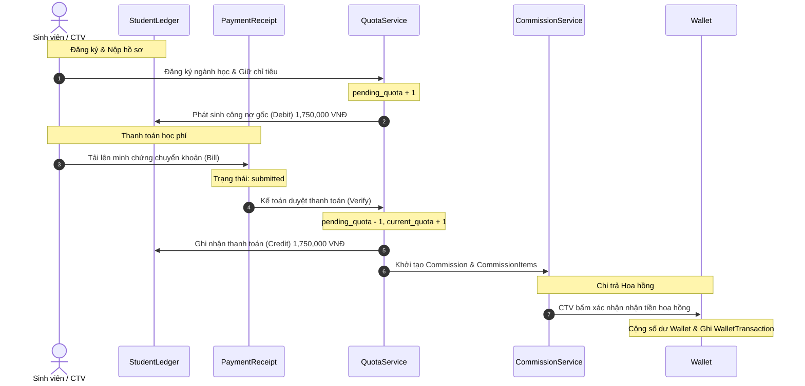

# 11-business-model.md - Mô hình Nghiệp vụ Tài chính & Tuyển sinh (BRD/SRS)

Mô hình nghiệp vụ này định hình toàn bộ thiết kế cơ sở dữ liệu và logic xử lý của hệ thống trước khi triển khai code. Mục tiêu là đảm bảo tính toàn vẹn dữ liệu, lịch sử tài chính không thể bị xóa/sửa đè, và bảo vệ hệ thống trước các tranh chấp tài chính của Cộng tác viên (CTV) và Sinh viên.

---

## 1. Trách nhiệm của từng Entity (Entity Responsibilities)

### 1.1 Student (Sinh viên / Hồ sơ)
*   **Trách nhiệm chính:** Đại diện cho thực thể người học đăng ký xét tuyển. Lưu trữ toàn bộ thông tin nhân thân, văn bằng cấp dưới (CCCD, Bằng Tốt nghiệp CĐ/THPT, GPA) và tình trạng xử lý hồ sơ hành chính.
*   **Ràng buộc tài chính:** Liên kết trực tiếp với Sổ cái tài chính của sinh viên (`StudentLedger`) để xác định nghĩa vụ đóng tiền.

### 1.2 Quota & AnnualQuota (Chỉ tiêu Tuyển sinh)
*   **Trách nhiệm chính:** Quản lý số lượng tối đa sinh viên được phép đăng ký và nhập học theo Ngành, Đợt tuyển sinh và Hệ đào tạo trong năm học.
*   **Ràng buộc tài chính:** Chứa cấu hình học phí gốc (`tuition_fee`) làm căn cứ để phát sinh công nợ ban đầu cho sinh viên.

### 1.3 StudentLedger (Sổ cái Công nợ Sinh viên)
*   **Trách nhiệm chính:** Lưu vết toàn bộ biến động tài chính của sinh viên theo nguyên tắc bất biến (Immutability). Mọi phát sinh công nợ, đóng tiền, hoàn tiền hay miễn giảm đều được ghi nhận thành một dòng giao dịch độc lập.
*   **Các loại giao dịch (`type`):**
    *   `debit` (Phát sinh công nợ học phí/lệ phí gốc).
    *   `credit` (Thanh toán thực tế từ sinh viên).
    *   `adjustment` (Điều chỉnh tăng/giảm công nợ do chuyển hệ, chuyển ngành hoặc miễn giảm học phí).
    *   `refund` (Hoàn trả tiền thực tế cho sinh viên).

### 1.4 PaymentReceipt (Chứng từ/Phiếu thu đóng tiền - Trước đây là Payment)
*   **Trách nhiệm chính:** Lưu trữ minh chứng giao dịch chuyển khoản thực tế (`bill_path`), phiếu thu chính thức (`receipt_path`), mã giao dịch ngân hàng và trạng thái xác minh của kế toán.
*   **Ràng buộc bất biến:** Một khi kế toán đã bấm xác nhận (`verified`), bản ghi này **không được phép chỉnh sửa số tiền** hoặc xoá bỏ để bảo đảm tính đối soát ngân hàng.

### 1.5 Commission & CommissionItem (Hoa hồng CTV)
*   **Trách nhiệm chính:** 
    *   `Commission`: Thực thể quản lý hoa hồng tổng của một hồ sơ nhập học.
    *   `CommissionItem`: Dòng tiền chi tiết phân phối cho từng CTV (Trực tiếp, Gián tiếp/Quản lý) với các điều kiện mở khóa khác nhau.
*   **Ràng buộc:** Trạng thái hoa hồng chuyển đổi dựa trên hành trình nhập học của học viên và quyết định thanh toán của kế toán.

### 1.6 Wallet & WalletTransaction (Ví & Biến động Ví CTV)
*   **Trách nhiệm chính:** 
    *   `Wallet`: Lưu số dư khả dụng thực tế của CTV dùng để rút tiền hoặc đối soát.
    *   `WalletTransaction`: Nhật ký biến động số dư ví (cộng hoa hồng, trừ do thu hồi, rút tiền về tài khoản ngân hàng).

---

## 2. Quy tắc Nghiệp vụ Bất biến (Business Rules)

### 2.1 Bất biến của PaymentReceipt (Phiếu thu)
*   **Quy tắc:** Không được phép chỉnh sửa trường `amount` (số tiền đóng thực tế) hoặc xóa bản ghi `PaymentReceipt` sau khi đã chuyển sang trạng thái `verified` (Đã xác nhận).
*   **Lý do:** Đây là chứng từ kế toán dùng để đối chiếu sổ phụ ngân hàng. Mọi sai sót hoặc thay đổi sau đó phải xử lý bằng giao dịch Điều chỉnh (`Adjustment`) hoặc Hoàn tiền (`Refund`).

### 2.2 Quy định bắt buộc tạo Adjustment (Điều chỉnh)
Hệ thống bắt buộc phải tạo dòng `adjustment` trong `StudentLedger` thay vì sửa đè dữ liệu cũ trong các trường hợp:
1.  **Chuyển ngành/hệ đào tạo** làm thay đổi định mức học phí của sinh viên.
2.  **Miễn giảm học phí** do chính sách ưu đãi tuyển sinh hoặc xét duyệt muộn.
3.  **Kế toán đối soát phát hiện sai sót** về số tiền phải đóng (cần tăng hoặc giảm nghĩa vụ đóng tiền của sinh viên).

### 2.3 Quy tắc Quota chặt chẽ
*   Chỉ tiêu tạm thời (`pending_quota`) tăng ngay khi hồ sơ được tạo.
*   Chỉ tiêu thực tế (`current_quota`) chỉ tăng và `pending_quota` chỉ giảm khi `PaymentReceipt` liên kết chuyển sang trạng thái `verified`.
*   Không cho phép ghi danh nếu tổng `current_quota` + `pending_quota` >= `target_quota`.

---

## 3. Quy trình Luồng Nghiệp vụ (Workflow Sequences)

---

## 4. Đặc tả luồng chuyển đổi nghiệp vụ lớn

### 4.1 Luồng Chuyển hệ / Chuyển ngành (Transfer Flow)
1.  Sinh viên yêu cầu chuyển đổi (ví dụ: Chính quy sang VLVH).
2.  Hệ thống kiểm tra Quota của ngành/hệ mới. Nếu đạt giới hạn, chặn giao dịch chuyển.
3.  Hệ thống giải phóng Quota cũ và giữ chỗ Quota mới.
4.  Tính toán chênh lệch học phí:
    *   Học phí hệ cũ: $T_1$. Học phí hệ mới: $T_2$.
    *   Tạo bản ghi `adjustment` trong `StudentLedger` với giá trị chênh lệch $T_{diff} = T_1 - T_2$.
5.  Tính toán chênh lệch hoa hồng CTV:
    *   Hệ thống tính toán hoa hồng mới cho CTV.
    *   Tạo bản ghi điều chỉnh `CommissionItem` (có thể âm nếu hoa hồng mới thấp hơn hoa hồng cũ đã chi trả).

### 4.2 Luồng Hoàn tiền (Refund Flow)
1.  Hồ sơ sinh viên chuyển sang trạng thái `dropped` (Bỏ học) hoặc `rejected` (Từ chối duyệt).
2.  Giải phóng chỉ tiêu Quota (Giảm `current_quota` của ngành/hệ đó).
3.  Kế toán phê duyệt số tiền hoàn trả lại cho sinh viên/CTV.
4.  Ghi nhận giao dịch `refund` trong `StudentLedger` để đưa số dư công nợ của sinh viên về `0`.
5.  Thu hồi hoa hồng CTV: Hủy các dòng hoa hồng chưa chi (`payable`, `pending` chuyển thành `cancelled`). Đối với hoa hồng đã chi, tạo giao dịch trừ số dư Ví của CTV (`WalletTransaction` âm).

---

## 5. Mô phỏng 50 Nghiệp vụ Thực tế (Scenario Simulations)

Dưới đây là 50 trường hợp nghiệp vụ thực tế chạy qua mô hình tài chính Ledger & Bất biến:

### Nhóm 1: Quy trình Đăng ký & Đóng tiền Bình thường (Scenarios 1 - 10)

#### Scenario 1: Đăng ký hệ Chính quy (Học phí 1,750,000 VNĐ) và đóng đủ tiền
*   **Bắt đầu:** SV tạo hồ sơ đăng ký.
*   **Ghi Ledger:** Tạo dòng 1: `debit` = `1,750,000`, `balance_after` = `-1,750,000`. Quota `pending` tăng 1.
*   **Nộp Bill & Verify:** CTV tải bill lên, kế toán bấm xác nhận phiếu thu.
*   **Ghi Ledger:** Tạo dòng 2: `credit` = `1,750,000`, `balance_after` = `0`. Quota `pending` giảm 1, `current` tăng 1.
*   **Hoa hồng:** Tạo `CommissionItem` = `1,750,000` (trạng thái: `payable`).

#### Scenario 2: Đăng ký hệ Vừa học vừa làm (Học phí 750,000 VNĐ) và đóng đủ tiền
*   **Ghi Ledger:** Dòng 1: `debit` = `750,000`, `balance_after` = `-750,000`.
*   **Nộp Bill & Verify:** Dòng 2: `credit` = `750,000`, `balance_after` = `0`.
*   **Hoa hồng:** Tạo `CommissionItem` = `750,000` (trạng thái: `pending` - chờ nhập học mới mở khóa).

#### Scenario 3: Đăng ký hệ Đào tạo từ xa (Học phí 200,000 VNĐ) và đóng đủ tiền
*   **Ghi Ledger:** Dòng 1: `debit` = `200,000`, `balance_after` = `-200,000`.
*   **Nộp Bill & Verify:** Dòng 2: `credit` = `200,000`, `balance_after` = `0`.
*   **Hoa hồng:** Tạo `CommissionItem` = `200,000` (trạng thái: `pending`).

#### Scenario 4: Đăng ký Chính quy đóng thừa tiền (1,800,000 VNĐ)
*   **Ghi Ledger:** Dòng 1: `debit` = `1,750,000`, `balance_after` = `-1,750,000`.
*   **Nộp Bill & Verify:** Dòng 2: `credit` = `1,800,000`, `balance_after` = `+50,000` (Sinh viên thừa tiền).
*   **Trạng thái:** Hồ sơ được duyệt bình thường, số tiền thừa `50,000` được giữ lại trên Ledger để cấn trừ lần sau hoặc hoàn trả sau này.

#### Scenario 5: Đăng ký Chính quy đóng thiếu tiền (1,700,000 VNĐ)
*   **Ghi Ledger:** Dòng 1: `debit` = `1,750,000`, `balance_after` = `-1,750,000`.
*   **Nộp Bill & Verify:** Dòng 2: `credit` = `1,700,000`, `balance_after` = `-50,000` (Sinh viên còn nợ).
*   **Trạng thái:** Hồ sơ chuyển sang trạng thái nợ tiền. Chỉ tiêu Quota `current` vẫn tăng do đã ghi nhận thanh toán một phần lớn, nhưng hệ thống cảnh báo chưa hoàn thành công nợ.

#### Scenario 6: Đăng ký Walk-in (Trực tiếp không qua CTV) hệ Chính quy
*   **Ghi Ledger:** Dòng 1: `debit` = `1,750,000`, `balance_after` = `-1,750,000`.
*   **Verify:** Dòng 2: `credit` = `1,750,000`, `balance_after` = `0`.
*   **Hoa hồng:** Hệ thống phát hiện nguồn là `walkin` nên không sinh bất kỳ dòng hoa hồng CTV nào.

#### Scenario 7: Đăng ký CTV cấp 2 giới thiệu (Có hoa hồng gián tiếp)
*   **Ghi Ledger:** Dòng 1: `debit` = `1,750,000`, `balance_after` = `-1,750,000`.
*   **Verify:** Dòng 2: `credit` = `1,750,000`, `balance_after` = `0`.
*   **Hoa hồng:** Sinh ra 2 dòng `CommissionItem`: Dòng 1 cho CTV chính (Trực tiếp: 1,500,000đ), Dòng 2 cho CTV quản lý (Gián tiếp: 250,000đ) dựa trên chính sách chia tách.

#### Scenario 8: Đăng ký học viên đóng tiền làm 2 đợt (Installments)
*   **Ghi Ledger:** Dòng 1: `debit` = `1,750,000`, `balance_after` = `-1,750,000`.
*   **Đợt 1:** Nộp bill 1,000,000 VNĐ -> Dòng 2: `credit` = `1,000,000`, `balance_after` = `-750,000`.
*   **Đợt 2:** Nộp bill 750,000 VNĐ -> Dòng 3: `credit` = `750,000`, `balance_after` = `0`.
*   **Hoa hồng:** Được kích hoạt sau khi tổng số tiền nộp đạt điều kiện tối thiểu hoặc cấn trừ đủ công nợ.

#### Scenario 9: Học viên được miễn giảm học phí 10% ngay lúc đăng ký
*   **Ghi Ledger:** 
    *   Dòng 1: `debit` = `1,750,000`, `balance_after` = `-1,750,000`.
    *   Dòng 2: `adjustment` (Miễn giảm 10%) = `175,000`, `balance_after` = `-1,575,000`.
*   **Verify đóng tiền:** Dòng 3: `credit` = `1,575,000`, `balance_after` = `0`.

#### Scenario 10: Học viên đóng lệ phí tuyển sinh riêng (50,000 VNĐ) và học phí riêng
*   **Ghi Ledger:** 
    *   Dòng 1: `debit` (Lệ phí) = `50,000`, `balance_after` = `-50,000`.
    *   Dòng 2: `debit` (Học phí) = `1,750,000`, `balance_after` = `-1,800,000`.
*   **Verify đóng tiền:** 
    *   Nộp bill lệ phí -> Dòng 3: `credit` = `50,000`, `balance_after` = `-1,750,000`.
    *   Nộp bill học phí -> Dòng 4: `credit` = `1,750,000`, `balance_after` = `0`.

---

### Nhóm 2: Chuyển Ngành & Hệ Đào Tạo (Scenarios 11 - 25)

#### Scenario 11: Đã đóng đủ Chính quy (1.75M) -> Chuyển sang VLVH (750k) chưa chi hoa hồng
*   **Ghi Ledger trước:** Debit `1,750,000` -> Credit `1,750,000` (Balance = `0`).
*   **Chuyển đổi:**
    *   Quota Chính quy được giải phóng (current -1), Quota VLVH tiêu thụ (current +1).
    *   Ghi Ledger Dòng 3: `adjustment` (Chuyển hệ CQ -> VLVH) = `1,000,000`, `balance_after` = `+1,000,000` (Sinh viên thừa 1 triệu đồng).
    *   `CommissionItem` cũ (Chính quy 1.75M, chưa chi) chuyển trạng thái sang `cancelled`. Sinh ra `CommissionItem` mới (VLVH 750k, trạng thái `pending`).

#### Scenario 12: Đã đóng đủ Chính quy (1.75M) -> Chuyển sang VLVH (750k) SAU KHI ĐÃ CHI HOA HỒNG
*   **Ghi Ledger trước:** Balance = `0`. CTV đã được cộng `1,500,000đ` vào Ví.
*   **Chuyển đổi:**
    *   Ghi Ledger Dòng 3: `adjustment` (Chuyển hệ CQ -> VLVH) = `1,000,000`, `balance_after` = `+1,000,000`.
    *   `CommissionItem` cũ đã ở trạng thái `received_confirmed` (không thể sửa đè).
    *   Hệ thống tạo dòng `CommissionItem` điều chỉnh: `amount` = `-750,000đ` (Trừ chênh lệch hoa hồng), trạng thái `payable` (tạo ngay dòng âm).
    *   Tự động ghi nhận `WalletTransaction` trừ `750,000đ` vào số dư ví của CTV.

#### Scenario 13: Đã đăng ký Chính quy (chưa đóng tiền) -> Chuyển sang VLVH (chưa đóng tiền)
*   **Ghi Ledger trước:** Debit `1,750,000` (Balance = `-1,750,000`).
*   **Chuyển đổi:**
    *   Quota Chính quy giải phóng (pending -1), Quota VLVH giữ chỗ (pending +1).
    *   Ghi Ledger Dòng 2: `adjustment` (Chuyển hệ CQ -> VLVH) = `1,000,000`, `balance_after` = `-750,000` (Sinh viên chỉ cần nộp 750,000đ).

#### Scenario 14: Đăng ký VLVH (750k) đóng đủ -> Chuyển sang Chính quy (1.75M)
*   **Ghi Ledger trước:** Debit `750,000` -> Credit `750,000` (Balance = `0`).
*   **Chuyển đổi:**
    *   Quota VLVH giải phóng, Quota Chính quy tiêu thụ.
    *   Ghi Ledger Dòng 3: `adjustment` (Chuyển hệ VLVH -> CQ) = `-1,000,000`, `balance_after` = `-1,000,000` (Sinh viên nợ thêm 1 triệu).
    *   `CommissionItem` cũ (VLVH 750k) chuyển `cancelled`. Sinh `CommissionItem` mới (CQ 1.75M, `payable`).

#### Scenario 15: Đăng ký VLVH (chưa đóng) -> Chuyển sang Chính quy (chưa đóng)
*   **Ghi Ledger trước:** Debit `750,000` (Balance = `-750,000`).
*   **Chuyển đổi:**
    *   Ghi Ledger Dòng 2: `adjustment` = `-1,000,000`, `balance_after` = `-1,750,000` (Yêu cầu nộp tiền tăng lên).

#### Scenario 16: Đã đóng đủ Chính quy -> Chuyển sang ngành khác cùng hệ Chính quy (Học phí không đổi)
*   **Ghi Ledger trước:** Debit `1,750,000` -> Credit `1,750,000` (Balance = `0`).
*   **Chuyển đổi:**
    *   Quota ngành cũ giải phóng (current -1), Quota ngành mới tiêu thụ (current +1).
    *   Ledger không đổi vì học phí bằng nhau.
    *   Commission giữ nguyên do cùng chính sách của hệ Chính quy.

#### Scenario 17: Đóng thiếu Chính quy (mới đóng 1M) -> Chuyển sang VLVH (750k)
*   **Ghi Ledger trước:** Debit `1,750,000` -> Credit `1,000,000` (Balance = `-750,000`).
*   **Chuyển đổi:**
    *   Ghi Ledger Dòng 3: `adjustment` = `1,000,000`, `balance_after` = `+250,000` (Sinh viên từ nợ chuyển sang thừa 250,000đ).

#### Scenario 18: Đăng ký Chính quy tự đóng tiền trực tiếp -> Chuyển sang CTV giới thiệu
*   **Ghi Ledger trước:** Balance = `0` (Không có CTV).
*   **Chuyển đổi:**
    *   Cập nhật `collaborator_id` của sinh viên từ `null` sang ID của CTV.
    *   Do học phí không đổi, Ledger không đổi.
    *   Hệ thống tự động kích hoạt tạo `CommissionItem` cho CTV đó dựa trên số tiền sinh viên đã đóng.

#### Scenario 19: Chuyển từ CTV A sang CTV B giới thiệu (Học phí không đổi)
*   **Ghi Ledger trước:** Balance = `0`.
*   **Chuyển đổi:**
    *   Hồ sơ cập nhật `collaborator_id` sang CTV B.
    *   `CommissionItem` cũ của CTV A (nếu chưa chi) chuyển sang `cancelled`.
    *   Tạo `CommissionItem` mới cho CTV B.

#### Scenario 20: Chuyển từ CTV A sang CTV B sau khi CTV A đã nhận hoa hồng
*   **Chuyển đổi:**
    *   Tạo dòng điều chỉnh hoa hồng âm cho CTV A để khấu trừ ví: `CommissionItem` = `-1,500,000 VNĐ`.
    *   Tạo dòng hoa hồng mới cho CTV B: `CommissionItem` = `1,500,000 VNĐ` (ở trạng thái `payable`).

#### Scenario 21: Chuyển đổi đợt tuyển sinh (Intake) làm thay đổi học phí gốc từ 1.5M lên 1.75M
*   **Chuyển đổi:**
    *   Ghi Ledger: Dòng điều chỉnh `adjustment` = `-250,000` (Nợ tăng do chuyển sang đợt tuyển sinh có học phí cao hơn).

#### Scenario 22: Chuyển ngành làm thay đổi chính sách hoa hồng CTV (từ Fixed sang JSON Split)
*   **Chuyển đổi:**
    *   Hủy dòng hoa hồng Fixed cũ.
    *   Sinh các dòng hoa hồng mới chia làm 2 cấp (Direct & Override) theo chính sách ngành mới.

#### Scenario 23: Chuyển hệ 2 lần liên tục (CQ -> VLVH -> Đào tạo từ xa)
*   **Chuyển đổi:**
    *   Ghi Ledger dòng 3: `adjustment` (CQ -> VLVH) = `+1,000,000`.
    *   Ghi Ledger dòng 4: `adjustment` (VLVH -> Từ xa) = `+550,000`.
    *   Tổng balance cuối cùng = `+1,550,000 VNĐ` (Thừa tiền).

#### Scenario 24: Chuyển hệ khi chỉ tiêu hệ mới đã đầy (Quota Full)
*   **Chuyển đổi:**
    *   Hệ thống kiểm tra `available_slots` hệ mới = `0`.
    *   Chặn không cho phép cập nhật `quota_id` mới. Giữ nguyên trạng thái cũ. Không phát sinh giao dịch tài chính.

#### Scenario 25: Chuyển hệ nhưng giữ nguyên mức học phí ưu đãi cũ (Miễn áp dụng biểu phí mới)
*   **Chuyển đổi:**
    *   Nhân viên tích chọn "Bảo lưu mức phí cũ".
    *   Hệ thống ghi nhận `adjustment` = `0` để khớp sổ, sinh viên không bị nợ thêm hay thừa tiền.

---

### Nhóm 3: Hoàn tiền, Bỏ học & Rút hồ sơ (Scenarios 26 - 35)

#### Scenario 26: Rút hồ sơ hoàn trả 100% học phí Chính quy (chưa chi hoa hồng)
*   **Ghi Ledger trước:** Balance = `0` (Đã đóng 1.75M).
*   **Rút hồ sơ:**
    *   Hồ sơ chuyển sang `dropped`. Quota giải phóng (current -1).
    *   Ghi Ledger Dòng 3: `refund` (Hoàn trả học phí) = `-1,750,000`, `balance_after` = `0`.
    *   `CommissionItem` chưa chi chuyển trạng thái sang `cancelled`.

#### Scenario 27: Rút hồ sơ hoàn trả 100% học phí SAU KHI ĐÃ CHI HOA HỒNG cho CTV
*   **Rút hồ sơ:**
    *   Ghi Ledger Dòng 3: `refund` = `-1,750,000`.
    *   Hủy hoa hồng CTV: Do hoa hồng đã chi, tạo dòng điều chỉnh `CommissionItem` = `-1,500,000 VNĐ` để khấu trừ vào ví của CTV (Ví CTV có thể bị âm nếu số dư hiện tại nhỏ hơn 1.5M).

#### Scenario 28: Từ chối duyệt hồ sơ (Rejected) và hoàn trả lệ phí
*   **Ghi Ledger trước:** Đã đóng 50,000 VNĐ lệ phí.
*   **Hành động:** Chuyển trạng thái sang `rejected`.
*   **Ghi Ledger:** Dòng `refund` = `-50,000` (đưa số dư về `0`).

#### Scenario 29: Hoàn trả 50% học phí do rút hồ sơ giữa chừng
*   **Ghi Ledger trước:** Đã đóng 1,750,000 VNĐ.
*   **Hành động:** Hoàn trả 875,000 VNĐ.
*   **Ghi Ledger:** 
    *   Dòng 3: `adjustment` (Khấu trừ học phí do học nửa chừng) = `875,000`.
    *   Dòng 4: `refund` (Chi trả thực tế cho SV) = `-875,000`, `balance_after` = `0`.

#### Scenario 30: Rút hồ sơ nhưng cấn trừ lệ phí thủ tục (100,000 VNĐ) trước khi hoàn tiền
*   **Ghi Ledger:**
    *   Dòng 3: `debit` (Lệ phí rút hồ sơ) = `100,000`, `balance_after` = `-100,000`.
    *   Dòng 4: `adjustment` (Giảm học phí gốc về 0) = `1,750,000`.
    *   Dòng 5: `refund` (Chi trả thực tế phần còn lại) = `-1,650,000`, `balance_after` = `0`.

#### Scenario 31: Hoàn tiền đóng dư cho sinh viên (Scenario 4)
*   **Ghi Ledger trước:** Balance = `+50,000` (Sinh viên đóng thừa 50k).
*   **Hành động:** Trả lại 50,000 VNĐ tiền đóng dư cho SV.
*   **Ghi Ledger:** Dòng 3: `refund` = `-50,000`, `balance_after` = `0`.

#### Scenario 32: Thu hồi hoa hồng CTV khi sinh viên bị phát hiện gian lận bằng cấp
*   **Hành động:** Huỷ hồ sơ sinh viên.
*   **Ghi Ledger:** Hoàn trả học phí về `0` (nếu có hoàn trả cho SV).
*   **Ví CTV:** Thực hiện giao dịch trừ ví CTV tương ứng với số hoa hồng đã phát sinh.

#### Scenario 33: Rút hồ sơ nhưng CTV đồng ý chịu phạt trừ 50% hoa hồng
*   **Hành động:** 
    *   Thu hồi 50% hoa hồng CTV -> Tạo dòng điều chỉnh `CommissionItem` âm tương ứng.
    *   50% còn lại giữ nguyên coi như phí giới thiệu đã hoàn thành.

#### Scenario 34: Hoàn tiền học phí nhưng sinh viên đồng ý chuyển số tiền đó cho hồ sơ của em ruột
*   **Hồ sơ SV1 (Người rút):** Ghi Ledger dòng `adjustment` giảm công nợ nộp tiền chuyển sang cho SV2.
*   **Hồ sơ SV2 (Người nhận):** Ghi Ledger dòng `credit` nhận tiền cấn trừ từ SV1.

#### Scenario 35: Hoàn tiền bằng chuyển khoản ngân hàng thất bại (Reverted Refund)
*   **Hành động:** Giao dịch ngân hàng lỗi, tiền trả ngược về tài khoản nhà trường.
*   **Ghi Ledger:** Tạo dòng `adjustment` đảo ngược giao dịch hoàn tiền lỗi để khôi phục số dư tạm thời cho sinh viên trên hệ thống.

---

### Nhóm 4: Bù trừ & Điều chỉnh (Scenarios 36 - 45)

#### Scenario 36: Bù trừ học phí đóng dư của học viên sang Lệ phí xét tuyển
*   **Ghi Ledger:** 
    *   Dòng 1: `debit` (Học phí) = `1,750,000`.
    *   Dòng 2: `credit` (Nộp tiền) = `1,800,000` (Balance = `+50,000`).
    *   Dòng 3: `debit` (Lệ phí xét tuyển phát sinh thêm) = `50,000`, `balance_after` = `0` (Tự động bù trừ).

#### Scenario 37: Điều chỉnh tăng học phí do sinh viên chọn thêm môn phụ đạo
*   **Ghi Ledger:** Dòng `adjustment` (Học phần bổ sung) = `-300,000` (Yêu cầu sinh viên nộp thêm 300,000đ).

#### Scenario 38: Khấu trừ tiền phạt nộp hồ sơ muộn
*   **Ghi Ledger:** Dòng `debit` (Phí nộp muộn) = `100,000`. Sinh viên phải nộp thêm tiền.

#### Scenario 39: Bù trừ hoa hồng âm của CTV vào đợt hoa hồng tháng sau
*   **Ví CTV:** Đợt này ví CTV bị âm `-500,000đ` (do sinh viên cũ rút hồ sơ).
*   **Tháng sau:** Phát sinh hoa hồng mới `1,500,000đ`.
*   **Kết quả:** Số dư khả dụng trong ví CTV tự động tăng lên thành `+1,000,000đ` (đã bù trừ tự động).

#### Scenario 40: Kế toán điều chỉnh giảm học phí thủ công cho con em cán bộ trong trường (Miễn giảm 50%)
*   **Ghi Ledger:** Dòng `adjustment` (Ưu đãi nội bộ) = `875,000` (Làm giảm số tiền nợ của sinh viên đi một nửa).

#### Scenario 41: Khấu trừ hoa hồng CTV để bù vào nợ lệ phí của sinh viên do CTV đứng ra bảo lãnh
*   **Ví CTV:** Trừ ví CTV `-50,000 VNĐ`.
*   **Ledger Sinh viên:** Ghi nhận `credit` = `50,000 VNĐ` cấn trừ công nợ từ tài khoản CTV.

#### Scenario 42: Bù trừ học phí của 2 đợt đóng tiền khác nhau của cùng 1 sinh viên
*   **Ghi Ledger:** Tự động đối chiếu tổng Debit và tổng Credit trên Ledger để kết xuất số dư hiện tại của học viên.

#### Scenario 43: Kế toán xóa nhầm Phiếu thu (Khi trạng thái là submitted - chưa verify)
*   **Hành động:** Cho phép hủy/xóa do chưa xác nhận ghi sổ chính thức. Ledger không bị ảnh hưởng vì chưa ghi nhận dòng `credit` thực tế.

#### Scenario 44: Kế toán hủy Phiếu thu sau khi đã Verify (Phát hiện lỗi sai ngân hàng)
*   **Hành động:** Không được sửa bản ghi cũ. Tạo bản ghi `reverted` hoặc dòng `adjustment` âm trên Ledger để hủy bỏ khoản ghi nhận thanh toán cũ.

#### Scenario 45: Điều chỉnh chỉ tiêu Quota thủ công do nhà trường cấp thêm chỉ tiêu đột xuất
*   **Quota:** Admin chỉnh sửa `target_quota` từ 100 lên 120. Trạng thái Quota tự động chuyển từ `full` về `active`.

---

### Nhóm 5: Tình huống Đặc biệt & Race Condition (Scenarios 46 - 50)

#### Scenario 46: 2 sinh viên bấm nộp hồ sơ cùng 1 giây vào 1 Slot Quota cuối cùng
*   **Xử lý:** DB lock `lockForUpdate()` hoạt động. Yêu cầu của sinh viên A được duyệt trước, Quota tăng lên mức tối đa và chuyển sang trạng thái `full`. Yêu cầu của sinh viên B bị chặn lại ngay lập tức và báo lỗi "Đợt tuyển sinh đã đầy chỉ tiêu".

#### Scenario 47: CTV bấm Xác nhận nhận hoa hồng 2 lần liên tiếp rất nhanh (Double Click)
*   **Xử lý:** Nhờ cơ chế khóa dòng `CommissionItem` bằng `lockForUpdate()`, request đầu tiên chuyển trạng thái sang `received_confirmed` và cộng tiền ví. Request thứ hai kiểm tra trạng thái thấy không còn là `payment_confirmed` nên bị loại bỏ ngay lập tức, ngăn chặn cộng tiền ví 2 lần.

#### Scenario 48: Sinh viên chuyển ngành liên tục 3 lần trong lúc kế toán đang mở đối soát
*   **Xử lý:** Mọi giao dịch chuyển ngành đều tạo ra một dòng `StudentTransfer` và ghi nhận một dòng `adjustment` độc lập trên Ledger. Số dư công nợ của sinh viên luôn phản ánh chính xác kết quả cuối cùng sau 3 lần điều chỉnh.

#### Scenario 49: Thu hồi ví CTV nhưng số dư ví CTV đang bằng 0 VNĐ
*   **Ví CTV:** Số dư giảm xuống mức âm (ví dụ: `-1,500,000đ`). CTV không thể thực hiện lệnh rút tiền cho đến khi giới thiệu thêm học viên mới và đưa số dư ví trở lại mức dương.

#### Scenario 50: Sinh viên đóng tiền học phí trước khi Quota của ngành được cấu hình chính thức
*   **Xử lý:** `StudentFeeService` kích hoạt cơ chế Fallback để lấy mức phí mặc định theo hệ đào tạo (`1,750,000đ` đối với Chính quy) để tạo dòng công nợ `debit` trên Ledger, đảm bảo giao dịch đóng tiền vẫn thực hiện bình thường mà không bị treo hệ thống.
